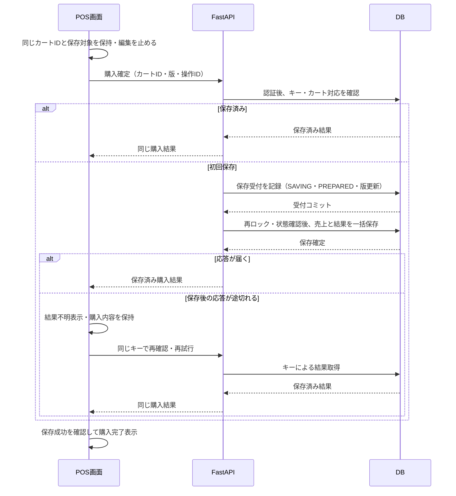

# 保存処理

[要件本文](../../要件定義書.md) · [設計本文](../../設計仕様書.md) · [対応表](../対応表.md) · [文書マップ](../文書マップ.md)

2026-09-27整理。現行本文から移した詳細の正本。章番号は整理前と共通。条件・数値・承認状態は変更していない。

[7. 取引保存・整合性設計](#sec-7)

## 7. 取引保存・整合性設計

### 7.1 保存契約

1カート1売上とし、保存済みなら同じ購入結果を返す。保持した商品条件で計算し、売上・全明細・税集計を原子的に確定する。DB一意制約と以下の処理を併用する。

操作可否は[3.4](画面と業務処理.md#sec-3-4)、同一要求・異内容の判定は[5.1.2](通信とデータ.md#sec-5-1-2)、データ制約は[6.2](通信とデータ.md#sec-6-2)を参照。結果不明の取引を新しいcart_idで送り直さない。

### 7.2 保存・未保存確定・編集再開

**同じPOST /api/purchases内で、受付と売上を別のDBトランザクションで確定する。** 受付後の停止でも編集禁止をDBに残す。別サービス・ジョブは追加しない。

1. **受付**：[5.1.2](通信とデータ.md#sec-5-1-2)でロック・同操作照合。版一致、EDITING／UNSAVED、会員確認待ちでないこと、商品1件以上を検査する。保持条件を検証し、SAVING・PREPARED・版＋1・active_purchase_operation_id・受付時版をコミットする。購入成功はまだ返さない。
2. **保存**：次のトランザクションで再ロック。PREPARED・SAVING・有効な操作ID・受付時版の一致を確認し、保持条件で再計算する。PURCHASE・全明細・税集計・SAVED・版更新・APPLIEDを一括コミット。cart_id主キーでも二重登録を拒否する。クライアントの金額・担当者は採用しない。
3. **再送**：APPLIEDは既存結果、REJECTEDは元の拒否を返す。PREPAREDは利用者の明示的な同要求再試行だけ手順2へ進め、ロック後に再検査する。別操作IDでも売上があれば、版検査より先に既存結果を返し、要求との対応を記録する。同操作の異内容検出は常に先行させる。
4. **障害**：失敗したトランザクション全体をロールバック。状態不明の接続は再利用せず、新接続で照合し、必要なら未保存確定へ進む。コミット応答断を成功／失敗と推測しない。自動購入再実行、GET・再読込・再認証による手順2の起動は禁止。

空カートの拒否：上記の新規受付条件を検査する時点で商品0件なら、HTTP 409・Errorの`code=STATE_CONFLICT`を返す。カートをSAVINGへ進めず、売上・明細・税集計を作成しない。商品あり・合計0円は許可する。同一操作の照合と保存済み結果返却の優先順は上記のまま。これは2026-09-27本人承認による通信契約の明確化であり、既存の空カート拒否要件は変更しない。

**未保存確定（resolve-purchase）**：確認用の別operation_idを用いて、遅延要求を無効化する。

1. 共通順でロック・同操作照合。売上ありならSAVED。なければversion一致を必須とし、不一致は409＋再取得、ロック／照合不能はUNKNOWN。
2. SAVINGなら有効操作のPREPAREDをREJECTED（`PURCHASE_ATTEMPT_CLOSED`）へ変更。未到着要求のあるEDITINGも対象にできる。UNSAVED・版＋1・確認操作APPLIEDを一括確定する。既にUNSAVEDでも、新しい確認操作なら版を1増やして未到着の旧購入要求を無効化する。同じ確認操作の再送だけは追加で増版しない。EDITING＋会員PENDINGは下記の専用分岐を先に適用する。
3. コミット確認後だけUNSAVEDを返す。保存が先ならSAVED、確認が先なら旧保存処理を状態・版・操作記録で拒否する。未到着要求も旧版で拒否し、新版へ付け替えて再送しない。

**会員PENDINGと購入不明の重複**：resolve-purchaseの同操作照合・売上照合・期待版検査後、EDITING＋PENDINGかつ有効な購入PREPAREDなしの場合は、会員待ちの先行解消を要求しない。共通ロック下で版を1増やし、EDITING・PENDING・入力会員ID・旧会員の参考値・商品条件を保持する。旧会員操作がPREPAREDならREJECTED（`MEMBER_LOOKUP_SUPERSEDED`）・completed_atを確定し、既にREJECTEDなら元の理由・完了時刻を維持する。PENDINGのactive_member_operation_idは保持し、次の再照会／非会員選択で置換・解除する。旧会員結果は操作状態と版で拒否する。確認操作のAPPLIED・applied_version・`code=PURCHASE_FENCED_MEMBER_PENDING`を同じTXで記録する。これは技術的な同期でありlast_business_at・復帰Cookie期限を延長しない。版上限なら変更せず既存の上限エラーと停止を適用する。

この分岐の初回成功は200 OperationResult、cart.state=EDITING・member_state=PENDING、purchase_status=NOT_REQUESTED・purchase=null。専用codeと適用版が旧要求無効化の証拠であり、一般のNOT_REQUESTEDを未保存確定と扱わない。同じ確認の再送・操作GETでも記録済みcode・applied_versionを返し、cartは現在値を返す。売上先着はSAVED、SAVINGは通常の未保存確定、版不一致・照合不能は既存の拒否／停止に従う。補助記録の除去と会員操作への復帰は[5.1.3](通信とデータ.md#sec-5-1-3)に従う。

結果確認の内部通信とし、ボタンは追加しない。応答不明では同確認操作を照合・再送し、新購入操作を発行しない。画面が購入応答不明を保持する間は、DBがEDITINGでも確定前の編集を許可しない。期限切れ・Cookie消失は[3.6](画面と業務処理.md#sec-3-6)・[9.4](認証と運用.md#sec-9-4)を適用する。

**編集再開（reopen）**：同じロック下で売上なし・UNSAVED・期待版一致を検査し、内容・会員・条件を保ったEDITING・版＋1・操作成功を一括確定する。売上あり／SAVINGは拒否。「そのまま再試行」はreopenせず、同cart_id・最新版・新操作IDで受付へ進む。過去の購入操作は再利用しない。

DBはInnoDB明示トランザクション、`SELECT ... FOR UPDATE`による最新確定値の検査、READ COMMITTEDを使用する。検査と更新を別トランザクションに分けない。ロック待ち・接続設定・索引は[Q01](../../設計残課題.md#q01)・[Q09](../../設計残課題.md#q09)。待ち時間超過は未保存の証拠にしない。

参考：[MySQLロック付き読み取り](https://dev.mysql.com/doc/refman/8.4/en/innodb-locking-reads.html)、[エラー時のロールバック範囲](https://dev.mysql.com/doc/refman/8.4/en/innodb-error-handling.html)。

### 7.3 保存・再試行のシーケンス

上図は初回成功・応答断・保存済み再送を表す。受付後の中断、未保存確定との競合は[7.2](保存処理.md#sec-7-2)、判定結果は[7.4](保存処理.md#sec-7-4)に従う。

### 7.4 保存結果の分類

| 分類 | 判断根拠 | 応答・画面 |
|---|---|---|
| 保存成功 | 取引・明細・税集計の確定を確認、または保存済み結果を取得 | 購入完了を表示 |
| 未保存を確認 | 保存が確定しておらず、同じ処理が後から確定する可能性もないことを確認 | エラー表示・内容保持。そのまま再試行、または「内容を修正する」で編集へ戻る |
| 保存結果不明 | 応答断、確定結果の照合不能、処理継続など | 「保存結果を確認できません」。変更・次取引を禁止 |

結果表示終了後は[7.5](保存処理.md#sec-7-5)で新しいカートへ移行し、保存済みカートを再利用しない。

### 7.5 次取引への移行

next要求は元カートの期待版と操作IDを送る。共通順でロックし、元カートのSAVED・結果表示未終了・REGISTERの継続対象一致を確認する。同じトランザクションで元カートをCLOSED／結果表示終了・版＋1、新しい空カート（version="1"、会員未指定）の作成、REGISTERの参照切替、操作結果へのnew_cart_id記録を確定する。担当者認証は維持する。

同要求の再送は記録済みnew_cart_idを返し、別操作による再移行は409。応答不明は旧カートの操作GETで反映状態とnew_cart_idを確認し、画面の継続対象はresumeで取得する。操作GETのcartは旧カートであり、POST next応答の次カートとは区別する。new_cart_idはCART_OPERATION.next_cart_idから返し、その後さらに次へ進んでいても書き換えず、過去のnew_cart_idへ逆戻りしない。初回作成もREGISTER排他で存在確認し、途中カートがあれば新規作成しない。

### 7.6 競合時の処理

| 順序・事象 | 設計上の結果 |
|---|---|
| 商品追加確定後に応答断→同じ要求を再送 | 操作結果を版検査より先に返し、数量を二重加算しない |
| 2タブが同じ版で別の数量変更 | 先着だけが版を更新。後着は409。自動上書きしない |
| 購入受付後にアプリ停止→別タブから編集 | DBのSAVINGにより拒否。復帰照会では売上を自動保存しない |
| 売上コミット後に応答断→再送／結果確定 | 保存済みの同じ購入結果。売上1件 |
| UNSAVEDから再試行要求が遅延→新しい未保存確定が先着 | 確認ごとに版を進めて旧要求を拒否。同じ確認の再送は増版なし |
| 購入不明と会員PENDINGが重複 | 旧購入要求を無効化してもPENDINGを保持し、対象補助記録だけ除去後に再照会／非会員選択へ。商品編集・購入はまだ不可 |
| 未保存確定が先→旧購入要求・旧保存処理が遅着 | 旧版またはREJECTEDで拒否。編集後の古い内容を保存しない |
| 購入保存が先→未保存確定・編集再開 | 未保存と通知せず保存結果を返す。編集再開は拒否 |
| 同じ操作IDで数量や版を変更 | OPERATION_MISMATCH。成功済みの操作も上書きしない |
| 次取引移行コミット後に応答断→同じ要求を再送 | 同じ次カートを返す。さらに空カートを増やさない |
| 初回DB確定後にCookie応答断 | 有効Cookieがあればconfirm、なければ停止。開始対応を再発行しない |
| confirm応答断→同じCookieで再送 | 同じREADYを返す。カートを増やさない |
| 再読込のsyncと未到着の商品更新が競合 | 更新先着なら再取得、sync先着なら旧要求拒否。未送信入力を復元しない |
| タブ通知が欠落／旧会員照会が遅着 | 通知では許可を決めずDB版を検査。旧照会で新選択を上書きしない |
| 商品条件取得中に関連マスタ更新 | 単一SELECTの確定済みスナップショットを保持。関連マスタ更新も一括確定 |
| 手動復帰が途中で失敗 | maintenance_holdを維持。期限・対象・結果の照合完了前は解除不可 |

要件対応は[10.1](要件対応.md#sec-10-1)。

