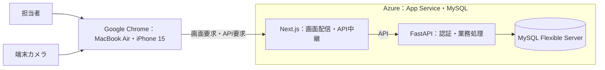

# 構成と用語

[要件本文](../../要件定義書.md) · [設計本文](../../設計仕様書.md) · [対応表](../対応表.md) · [文書マップ](../文書マップ.md)

2026-09-27整理。現行本文から移した詳細の正本。章番号は整理前と共通。条件・数値・承認状態は変更していない。

[1. 文書概要・設計前提](#sec-1) / [2. システム構成・ソフトウェア構造](#sec-2)

## 1. 文書概要・設計前提

### 1.1 目的・範囲

1店舗・有人レジ1台のコンビニについて、ログイン→商品登録・編集／任意時点の会員指定→購入確定→結果表示→次取引を設計する。食品・日用品を商品コードと個数で販売する。店内飲食・量り売り・取消・管理画面・実決済・在庫管理は対象外。マスタ更新手順は設計する。

### 1.2 制約

Next.js・FastAPI・API連携・Azure・Azure Database for MySQL Flexible Serverを使用し、MacBook Air・iPhone 15のGoogle Chromeに対応する。タブレットと他の端末・ブラウザは対象外。

設計の確定状況と実行条件は[設計残課題](../../設計残課題.md)を参照する。

### 1.3 用語・仕様の参照先

| 用語 | 意味 |
|---|---|
| カート | 購入前の商品行の集合（購入リスト） |
| 商品行の条件／スナップショット | 最初の追加時の税抜単価・税率・会員値引き候補を保持し、マスタ変更の影響を受けない情報 |
| cart_id | カートと購入に共通の識別子。別の取引キーは設けない |
| version | 内容・状態の共通版。保存専用版は設けない |
| operation_id | 新しい操作と同じ操作の再送を区別する識別子 |
| 原子的保存 | 必要な全記録を保存するか、全て保存しない扱い |
| API契約 | 入出力・実行条件・副作用・失敗／再送時の約束 |

仕様の正本は、操作・表示＝[3章](画面と業務処理.md#sec-3)、計算＝[4章](画面と業務処理.md#sec-4)、通信の振る舞い＝[5章](通信とデータ.md#sec-5)・型と必須項目＝[API契約.openapi.json](../../API契約.openapi.json)、保存構造＝[6章](通信とデータ.md#sec-6)、保存処理順＝[7章](保存処理.md#sec-7)、認証＝[8章](認証と運用.md#sec-8)、運用＝[9章](認証と運用.md#sec-9)。図のMermaidソースも本書で管理する。物理列・制約の詳細は[設計スキーマ.sql](../../設計スキーマ.sql)、適用後の読取確認は[設計確認.sql](../../設計確認.sql)。

### 1.4 関連文書

- 原要求：[要求仕様.md](../../要求仕様.md)
- 技術設定・DB作業詳細：[設計設定・DB運用.md](../../設計設定・DB運用.md)
- 残課題・検証状態・費用：[設計残課題.md](../../設計残課題.md)
- 決定経緯・改訂履歴：[設計承認履歴.md](../../設計承認履歴.md)

## 2. システム構成・ソフトウェア構造

### 2.1 全体構成

FastAPIが認証・商品／会員検証・金額・保存の正を担い、ブラウザはDBへ直接接続しない。Next.jsが同一オリジンでAPIを中継する（[9.1](認証と運用.md#sec-9-1)）。外部ID基盤は使わない。

### 2.2 主要な処理単位

| 処理単位 | 責務 | 主な依存・禁止事項 |
|---|---|---|
| 画面・入力管理 | 入力、選択、表示、読取モード、操作制限、応答待ち | API応答を表示。金額の正を独自に決定しない |
| カメラ読取 | 商品／会員のコード認識、1回の読取確定、次の読取受付 | 商品と会員の入力先を明示。方式は[Q03](../../設計残課題.md#q03) |
| 認証 | パスワード照合、ログイン状態確認、担当者特定 | 外部ID基盤に依存しない |
| 商品・会員照会 | コードによる照会、不存在と照会失敗の区別 | DBから取得。不要な会員属性を画面へ返さない |
| 商品条件保持・カート管理 | 最初の追加時の条件固定、数量・会員の反映 | 信頼できる条件をMySQLに保持する。更新競合・再送制御は[5.1.2](通信とデータ.md#sec-5-1-2)〜[5.1.3](通信とデータ.md#sec-5-1-3) |
| 金額計算 | 最大値引きの選択、数量反映、税率別集計 | 条件と入力から計算。DB・通信処理から分離 |
| 取引保存 | 同一取引判定、原子的保存、保存済み結果取得 | DB制約とトランザクションを利用する |
| データアクセス | 照会・更新、トランザクション、履歴保存 | UI表示や計算規則を持たない |

処理順は入力→認証・検証→保持条件で処理→保存／計算結果→表示。モジュール配置は[設計設定・DB運用](../../設計設定・DB運用.md)[1節](#sec-1)に従う。

