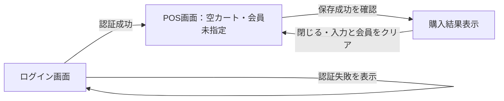
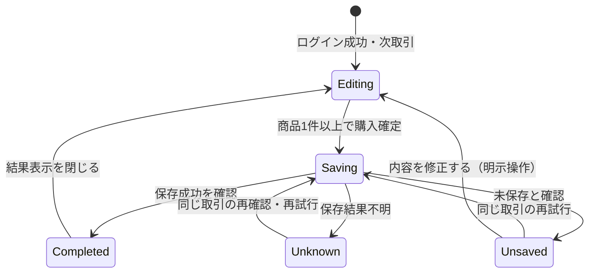
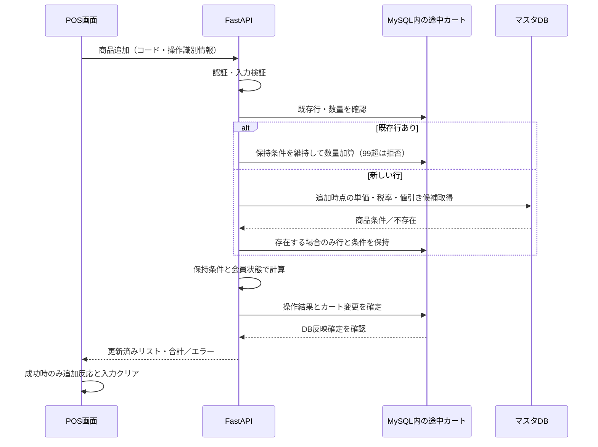

# 画面と業務処理

[要件本文](../../要件定義書.md) · [設計本文](../../設計仕様書.md) · [対応表](../対応表.md) · [文書マップ](../文書マップ.md)

2026-09-27整理。現行本文から移した詳細の正本。章番号は整理前と共通。条件・数値・承認状態は変更していない。

[3. 画面・操作・状態設計](#sec-3) / [4. 機能・処理設計](#sec-4)

<a id="sec-3"></a>

## 3. 画面・操作・状態設計

<a id="sec-3-1"></a>

### 3.1 画面構成

```text
ログイン画面
  担当者ID [                  ]
  パスワード [                ]
  [ログイン]   エラー表示領域

POS画面（横幅がある端末の配置）
  担当者：担当者ID           会員：未指定／確認済みID／会員確認待ち
  変更先の会員ID [       ] [照会] [会員バーコード読取]
  会員照会エラーと再入力・再照会・非会員選択
  -----------------------------------------------------
  商品コード [          ] [検索] [商品バーコード読取]
  名称・税抜単価の検索結果        [追加]
  -----------------------------------------------------
  購入リスト：名称｜数量｜税抜単価｜値引き額（行合計）｜税抜小計
  選択商品：名称・単価・数量 [1〜99] [数量変更] [削除]
  税抜合計・税率別税額・税込合計
  [購入確定]    処理中／エラー／結果不明の表示領域

購入結果表示
  購入完了（保存成功を確認したときだけ）
  税抜合計・税込合計
  [閉じて次の取引へ]
```

Lv1末尾「画面イメージ（Lv1）」の①読込・②コード・③名称・④単価・⑤追加を入力領域、⑥購入リスト・⑦購入を会計領域へ対応させた。図の同一商品別行はLv2の数量加算へ置換し、会員・選択行編集・値引き・税を追加する。参考図の模写を目的とせず、Lv2と現行要件を優先する。

配置：横幅768 CSS px以上は入力を左、リスト・選択行・合計を右の2列、それ未満は同順の1列。担当者・会員状態は上部。スマホでも全項目を表示し、長い名称は折返す。操作部は高さ44 CSS px以上、文言付きボタン、選択行は色と「選択中」で示す。これらは調整可能な設計値であり、新しい要件数値ではない。実機でキーボード表示・縦横回転時の欠落や重なりを確認する。

手入力は検索→確認→追加、スキャンは認識→追加API内の検索・検証→追加。条件固定は追加時のみ。入力コードを変更したら旧検索結果と追加可否をクリアし、遅れた旧検索応答を表示しない。

<a id="sec-3-2"></a>

### 3.2 画面項目と操作

| 操作 | 動作・表示／保持 |
|---|---|
| 通常ログイン | 空カート・会員未指定でPOSへ。パスワードを引き継がない。誤認証文言は[8.2](認証と運用.md#sec-8-2) |
| 会員指定・変更 | 候補と確認済みIDを区別。商品追加の前後とも可。状態・再計算は[4.2](画面と業務処理.md#sec-4-2) |
| 会員不存在 | 「会員が見つかりません」＋再入力／非会員選択。購入リスト保持、旧会員を適用中と表示しない |
| 会員確認不能 | 「会員を確認できません。再照会するか、非会員として続けてください」。再入力も可能。購入リスト保持 |
| 商品追加 | 新規行追加／同一商品加算。成功反応後、商品コード・名称・単価の検索表示をクリア |
| 商品選択 | 1行を選択表示し、名称・単価・数量を確認。検索結果とは別領域 |
| 数量変更・削除 | 数量1〜99。0・100以上は拒否し元の内容を保持。削除は行を除去 |
| 上限で追加 | 99個を保持してエラー |
| 購入確定 | 空カートは無効、商品あり0円は可。送信中の連打を抑止。結果別の可否は[3.4](画面と業務処理.md#sec-3-4) |
| 内容を修正する | 未保存確定後だけ表示。明示操作で編集へ（[7.2](保存処理.md#sec-7-2)） |
| 結果を閉じる | 商品入力・表示・選択・カート・会員ID・特典をクリア。ログインを維持して次取引へ |

表示仕様：担当者は認証結果の「担当者ID」、会員は確認済みIDまたは未指定／確認待ちを表示する。会員の氏名等を追加取得しない。各行の「税抜単価」は保持単価、「値引き額（行合計）」は1個当たり値引き×数量、「税抜小計」は値引き後の行合計。全体は「税抜合計（値引き後）」「消費税（税率別）」「税込合計」とし、APIの計算値を使う。

検索表示には「追加時に価格を確定」を添える。検索後に単価が変わった場合は追加結果の単価を表示し、「追加時の価格に更新しました」と伝える。既存行への追加は保持単価を使い、検索価格と異なれば「購入リストの登録時価格を適用」と示す。再確認ダイアログは増やさない。

照会中・失敗時は旧値引き・合計を残し、「変更前の参考額・会員確認待ち」と表示し、購入結果とは扱わない。最初の会員指定失敗にも[4.2](画面と業務処理.md#sec-4-2)を適用する。

<a id="sec-3-3"></a>

### 3.3 画面遷移



保存失敗・結果不明はPOS上に表示する。ログイン期限切れ時は[8.1.1](認証と運用.md#sec-8-1-1)に従い、同じ画面に内容・状態を保持して再認証を求める。

<a id="sec-3-4"></a>

### 3.4 購入状態と操作制限



| 状態 | 内容変更 | 購入／再試行 | 次取引 |
|---|---|---|---|
| 編集中 | 可能。個別API処理中の制御は[5.1.3](通信とデータ.md#sec-5-1-3)で定義 | 商品1件以上で購入可能。値引き後0円も可。空カートは不可 | 不可。取消機能を追加しない |
| 保存処理中 | 不可 | 連打・自動再送を行わない | 不可 |
| 未保存を確認 | 保持。「内容を修正する」の明示操作で編集再開可能 | 同じ取引として再試行可能 | 不可 |
| 結果不明 | 不可 | 同じ取引として再確認・再試行可能 | 不可 |
| 購入完了 | 保存済み内容を変更しない | 再購入操作を受け付けない | 結果表示を閉じて移行 |

再認証待ちは購入状態に重ねる停止条件（[8.1.1](認証と運用.md#sec-8-1-1)）。会員確認待ちは商品編集・購入を止める。会員状態の遷移は[4.2](画面と業務処理.md#sec-4-2)を正とし、画面・保存APIの双方に適用する。通信中・復帰時の同期は[5.1.3](通信とデータ.md#sec-5-1-3)。

<a id="sec-3-5"></a>

### 3.5 再読込・ブラウザ終了後の復帰

同じ端末・ブラウザ、元担当者の認証で受付済み内容へ復帰する。 通常モードを利用条件とし、プライベート／シークレットモードは保証対象外。専用検知は実装しない。Cookie消失時は[3.6](画面と業務処理.md#sec-3-6)・[9.4](認証と運用.md#sec-9-4)による。失効時は[8.1.1](認証と運用.md#sec-8-1-1)を適用。初期表示では継続対象を照合し、無条件に新規作成しない。

| 復帰対象の状態 | 画面・操作 |
|---|---|
| 編集中 | 登録済み商品・数量・会員・追加時条件を復元して編集再開 |
| 会員確認待ち | 未確定を維持し、再照会などによる確認成功または非会員選択まで商品編集・購入不可 |
| 保存処理中・結果不明 | 同じ取引の保存結果を確認。確定するまで編集・次取引不可 |
| 未保存を確実に確認 | 内容保持。そのまま再試行／明示的な編集再開を選択 |
| 保存済み・結果表示未終了 | 保存済み購入結果を表示。購入を新規送信しない |
| 結果表示終了・次取引移行済み | 空カート・会員未指定で開始 |

未送信コード・会員ID・数量、選択行・カメラ映像は復元しない。応答断はDB反映を照合し、無条件再送・照会失敗時の空カート開始は行わない。

別端末への引継ぎは対象外。復帰照合は[6.4](通信とデータ.md#sec-6-4)、期限は[3.6](画面と業務処理.md#sec-3-6)、初回識別は[3.7](画面と業務処理.md#sec-3-7)、複数タブは[3.8](画面と業務処理.md#sec-3-8)による。

<a id="sec-3-6"></a>

### 3.6 復帰期限と例外時の停止

期限の正本は[要件3.4](../requirements/機能・非機能要件.md#sec-3-4)。初回カート作成、商品・数量・会員・購入状態・次取引の変更をDB確定したサーバー時刻から24時間経過前まで復帰可能。表示・照会・認証・拒否・処理済み再送では起算を更新しない。本人による手動復帰許可後は[9.4](認証と運用.md#sec-9-4)の起算を適用する。

BROWSER_CONTEXTにlast_business_atを保持し、対象変更と同じDBトランザクションで記録する。コミットされた記録だけを起算に使い、応答到着時刻・ブラウザ時計には依存しない。保存受付／売上確定／未保存確定／編集再開も状態変更として対象。同一操作の再送は新しい変更がない限り更新しない。手動復帰許可日時manual_released_atは別に保持する（[9.4](認証と運用.md#sec-9-4)）。期限判定は `現在のサーバー時刻 < 起算時刻 + 24時間`。起算時刻はlast_business_atとmanual_released_atのうち設定済みで新しい方（手動許可なしならlast_business_at）。初回カート作成前は[3.7](画面と業務処理.md#sec-3-7)の受渡し状態を適用し、last_business_at未設定を一般の期限免除には使わない。

復帰Cookieは初回発行時および正常な業務更新の応答で `Max-Age=2592000`（30日）を設定し、更新時も識別子を変えない。表示・照会・認証・拒否・処理済み再送では期限を更新しない。Cookie更新応答の欠落・遅延によってDB起算を巻き戻さず、Cookieが残っていても24時間経過後は停止する。認証8時間・Cookie30日・通常復帰24時間・DB保持期限は独立して扱う。

| 状況 | 扱い |
|---|---|
| 24時間経過前・有効な復帰情報あり | 元担当者を認証して[3.5](画面と業務処理.md#sec-3-5)の通常復帰 |
| 24時間経過後 | 復帰期限切れを表示して停止。自動取消・削除はしない |
| Cookie消失 | 復帰情報を確認できない旨を表示して停止。担当者だけで対象を推測しない |
| 保存結果不明 | 元の記録を保持し、結果確認まで新しい購入を始めない |

停止は画面と新規カート作成・購入保存APIに適用する。レジ担当者だけでは解除できず、開発・運用担当の本人が[9.4](認証と運用.md#sec-9-4)で確認する。Cookie不在時は[3.7](画面と業務処理.md#sec-3-7)で初回利用と消失を区別する。

<a id="sec-3-7"></a>

### 3.7 初回利用とCookie消失の識別

MySQLにレジ1台の管理データを1件保持し、利用開始済みか、有効なブラウザ対応、継続中取引を管理する。取引終了・ログイン失効・復帰期限切れで利用開始記録を未開始に戻さない。

| レジの記録 | 復帰用Cookie | 動作 |
|---|---|---|
| 未開始 | なし | 担当者認証後に初回開始。Cookie受取確認後に商品登録可能 |
| 開始済み | 有効 | 担当者認証と通常復帰条件を確認。継続対象があれば元の状態へ、なければ空カートへ |
| 開始済み | なし・無効 | 取引がなくても停止。別ブラウザで開いた場合も同じ。[9.4](認証と運用.md#sec-9-4)の手動確認へ |
| 記録を取得できない・整合しない | 任意 | 未開始と推測せず停止・確認する |

初回受渡しのREGISTERの開始状態をUNSTARTED→COOKIE_PENDING→READYとする。COOKIE_PENDINGも開始済みであり、UNSTARTEDへ戻さない。行は利用前に準備し、不在を未開始とみなして自動作成しない。

1. `/register/start`は担当者認証後にREGISTERをロック。UNSTARTEDの場合だけブラウザ対応・開始担当者・Cookie照合値を作成し、COOKIE_PENDINGと一括確定してCookieを返す。競合する開始要求は新しい対応を作らない。
2. ブラウザから返ったCookieを`POST /register/confirm`で照合する。開始担当者の有効な認証も確認し、REGISTERロック下でREADYへ進める。再送時に同じ対応がREADYなら成功を返し、Cookie再発行・カート追加は行わない。
3. READY後に`POST /carts`で最初の空カートを作る。既存の継続対象があればそれを返す（[7.5](保存処理.md#sec-7-5)）。開始・受取確認そのものは購入保存や業務時刻更新をしない。

初回応答が不明なら、GETのstatusで照合する。有効CookieでCOOKIE_PENDINGと確認できた場合だけconfirmを続けられる。Cookieなし／不一致、DB照合不能では商品登録を開始せず、停止・手動確認へ進む。開始済みのstart再送から識別情報を再発行しない。READY・未作成カートの組合せだけを初回作成可能とし、READYからCOOKIE_PENDINGへの通常遷移は設けない。

statusは読取専用。担当者・Cookie対応を確認できなければカート情報を返さない。初回前の認証失効は開始担当者の再認証だけで続行し、開始記録・Cookieを作り直さない。中間状態はMySQLへ保持し、アプリ再起動でも同じ判定とする。

<a id="sec-3-8"></a>

### 3.8 複数タブの扱い

「別タブでも開いています。操作するタブを1つにしてください」と警告する。特定タブへの操作権固定は行わない。

同一オリジンのBroadcastChannelを使用する。ページ起動時に一時的なタブ識別値をメモリで作り、参加通知と応答で相互検知する。表示復帰時にも照会し、閉じる通知は補助に使う。バックグラウンドで通知が止まっただけでは警告を解除しない。再読込で再検知する。通知はタブ存在と更新通知に限定し、Cookie・認証情報・会員情報は送らない。

更新通知は最新状態をGETし直す契機にだけ使う。未送信入力を勝手に適用せず、送信済み不明操作は[5.1.3](通信とデータ.md#sec-5-1-3)で照合する。検知APIが利用不能なら「別タブの利用状況を確認できません。操作するタブを1つにしてください」と表示する。対象ブラウザ適合は[Q03](../../設計残課題.md#q03)。

通知の遅れ・警告無視に関係なく、全変更は[5.1.2](通信とデータ.md#sec-5-1-2)の版・状態検査と[7.2](保存処理.md#sec-7-2)の二重保存防止に従う。参考：[Broadcast Channel API](https://developer.mozilla.org/en-US/docs/Web/API/Broadcast_Channel_API)。


<a id="sec-4"></a>

## 4. 機能・処理設計

<a id="sec-4-1"></a>

### 4.1 商品登録と条件保持

1. 手入力・スキャンのコードを同じ商品識別ルールで検証する。コードの先頭ゼロを失わない文字列として扱う。
2. 購入リストに既存行があれば、保持済み条件で数量を1増やす。99個なら変更せずエラー。
3. 新しい行なら、追加を受け付ける時点の単価、税率、その時点で対象商品・期間に該当する会員値引き条件を取得する。
4. 非会員でも値引き候補を保持する。会員の後入力に備え、最初の時点で有効な候補を失わない。
5. 商品行・保持条件・計算結果の更新が確定した後、画面へ結果を返す。
6. 行削除でその行の保持条件を除去する。再追加は新しい条件を取得する。

新規行の条件取得は、REGISTER・CARTをロックしてから、商品・税率・対象値引き候補をLEFT JOINした**単一の通常SELECT**で行う設計とする。READ COMMITTEDの1文のスナップショットを用い、DBで取得した1つの時刻を全期間判定に使う。値引き候補が0件でも商品行を失わない。条件固定・行追加・計算・操作結果は同じトランザクションで確定する。既存行の加算ではマスタを再取得しない。

関連マスタを同時に変更する運用は1トランザクションで確定し、単価変更履歴も含める（[9.3](認証と運用.md#sec-9-3)）。商品・税率・値引きを別々のSELECTで読んで混在させない。参考：[MySQLの一貫した読み取り](https://dev.mysql.com/doc/refman/8.4/en/innodb-consistent-read.html)。途中データは[6.3](通信とデータ.md#sec-6-3)、再送は[5.1.2](通信とデータ.md#sec-5-1-2)に従う。



通信失敗を商品不存在と表示しない。追加応答が途切れた際の再送では[5.1.2](通信とデータ.md#sec-5-1-2)の同一操作照合で二重加算を防ぐ。

<a id="sec-4-2"></a>

### 4.2 会員処理

会員IDの入力中は適用会員を変えず、照会開始時に「会員確認待ち」へ遷移する。状態をMySQLに保持し、画面・商品変更／保存APIで商品追加・数量変更・削除・購入を禁止する。確認成功で「確認済み会員」、明示的な非会員選択で「未指定の非会員」へ戻す。不在・通信障害は待ち状態を維持し、[3.2](#sec-3-2)の再入力／再照会／非会員選択を提示する。最初の指定失敗も同じ扱い。最初から未指定なら正常な非会員取引とする。

確認成功時は商品行に保持した候補で再計算し、最新キャンペーンへ差し替えない。非会員選択では旧会員ID・適用特典を解除するが、後の会員指定に備えて値引き候補は保持する。確認前は新会員の特典を適用せず、旧額を残す場合の表示は[3.2](画面と業務処理.md#sec-3-2)による。再入力・再照会・非会員選択は待ち状態でも許可し、別タブにも同じ制限を適用する。

同期の会員変更API内で、[5.1.2](通信とデータ.md#sec-5-1-2)のロック順に従って確認待ち・操作ID・受付時の共通版をDB確定してから照会する。完了時は再ロックし、現在の会員操作ID・版・確認待ち状態が一致する場合だけ結果と再計算を反映する。新しい会員指定・非会員選択を受け付けたら、旧操作を終了扱いにして版を進める。非会員選択は解除・再計算を一括確定する。同じ操作の再送は[5.1.2](通信とデータ.md#sec-5-1-2)に従い、旧照会の遅延結果で新しい選択を上書きしない。UIは送信開始から停止し、DB受付前の他タブ操作との競合は版不一致で検出する。 会員操作の受付はPREPARED、確認成功・非会員化はAPPLIED、不存在・確定した照会失敗・後続選択による置換はREJECTEDとする。照会不能の通知を記録できない場合はPREPAREDを保持する。再照会ボタンは最新の版で新操作を開始し、旧操作を終了させる。復帰GETは照会を自動実行しない。これによりアプリ再起動で残った確認待ちも、再照会または非会員選択から解消できる。

<a id="sec-4-3"></a>

### 4.3 金額計算

金額・率の範囲は[要件3.6](../requirements/機能・非機能要件.md#sec-3-6)、API表現は[5.2](通信とデータ.md#sec-5-2)。計算は整数・正確な十進数を用い、浮動小数点の丸めに依存しない。中間計算の桁を確保し、上限超過は切捨てず更新・保存を拒否する。

商品行ごとに、保持した税抜単価をp、数量をqとする。

1. 非会員の値引き額は0。会員は保持した候補のうち、割合なら `floor(p × 割引率)`、定額なら指定値引き額を候補額とする。
2. 候補額が最大の1件を選択する。同額なら条件ID昇順の最初の1件を選び記録する。
3. 値引き後単価は `max(0, p − 選択候補額)`。実際の1個当たり値引き額は `p − 値引き後単価`。候補額と実値引き額は区別して記録する。
4. 行小計は `値引き後単価 × q`。行値引き額は `実際の1個当たり値引き額 × q`。
5. 同じ税率の行小計を合算し、税率別税額を `floor(税率別小計 × 税率)` で計算する。
6. 税抜合計は行小計の合計。税込合計は税抜合計＋税率別税額の合計。

| [要件5.2](../requirements/受入条件_現行.md#sec-5-2)の条件 | 設計上の結果 |
|---|---|
| 103円×3個、10％引き、税率10％ | 値引き10円／個、行小計279円、税27円、税込306円 |
| 上記＋107円の商品を異なる2商品各1個、値引きなし・税率8％ | 8％小計214円・税17円、10％小計279円・税27円、税抜493円、税込537円 |
| 103円に10％引き・20円引き | 10円と20円から20円を選び、値引き後単価83円 |
| 103円に120円引き | 候補額120円、実値引き103円、値引き後単価・小計・税額は0円 |

条件の固定・再取得は[4.1](画面と業務処理.md#sec-4-1)による。

<a id="sec-4-4"></a>

### 4.4 カメラ処理

商品／会員の専用ボタンから共通の読取領域を開き、現在の読取先を明示する。HTTPS上で利用者の操作によりカメラを要求する。音声は要求せず、スマホ等は背面を優先し、取得できる既定カメラへ切替可能にする。映像はブラウザ内で処理し、画像をAPI送信・永続保存しない。手入力はカメラ許可なしで利用可能。

読取成功時は直ちに受付を閉じ、1つのoperation_idで商品追加または会員照会を行う。読めたことだけで「追加成功」にしない。APIの反映確認後に「商品名を1個追加（現在N個）」と行の強調、会員は「会員IDを確認しました」を表示する。音・振動は必須にしない。二重コールバック、古い読取モード・終了後のコールバックは読取回ごとの識別子で無視する。

| 状況 | 動作 |
|---|---|
| 許可拒否／カメラなし・起動失敗 | 「カメラを利用できません。手入力してください」。カートを保持し、再起動操作も可能 |
| 認識なし | 「バーコードを枠内に映してください」を表示。未登録商品とは判定せず、いつでも手入力へ閉じられる |
| 不正コード／未登録商品／数量上限 | それぞれのエラーを表示。追加成功表示なし。未登録・上限の場合は内容を保持 |
| API応答不明 | 読取受付を止め、[5.1.3](通信とデータ.md#sec-5-1-3)で元要求を照合。新しい追加として再送しない |
| 閉じる・モード変更・画面非表示・再認証・購入開始 | 読取回を無効化し映像トラックを停止。戻っただけではカメラを再起動しない |

許可待ち中に閉じた後で映像取得が完了しても、直ちに停止する。会員確認待ちは商品読取を開始できず、会員の再入力・再照会は[4.2](画面と業務処理.md#sec-4-2)に従う。権限・カート状態はAPIでも検査する。

**対象形式**：商品はEAN-13／EAN-8（JAN）とCode 128、会員はCode 128を対象にする。読取文字列は先頭ゼロ・大小文字を保持し、[要件3.6](../requirements/機能・非機能要件.md#sec-3-6)の共通形式で検証する。JANの桁を補完・除去して別コードへ変換しない。英数字を含む演習コードはCode 128で用意する。QR等の追加形式は今回含めない。

**連続読取**：毎回の押下を不要とする。商品1件の反映確認後、カメラを保ったまま次の異なるコードを自動受付する。同じコードが映り続ける間は加算せず、「同じ商品です。追加する場合は一度枠から外してください」と表示する（ダイアログや反復通知にしない）。同じ商品を再度追加するには、一度枠から外して再提示するか、既存の数量変更を使う。会員は1件確認後に閉じる。

読取枠内で最後に処理したコードを抑止し、異なるコードの認識、またはコード未検出が連続した後の再認識で次の受付へ進む。単なる経過時間では同コードの抑止を解除しない。未検出の継続を判定し、一瞬の認識欠落では再加算しない。調整値と誤解除の確認は[Q03](../../設計残課題.md#q03)で管理する。抑止は通信中も保持し、待ち時間中の別コードをキューに溜めない。未登録・上限等の確定エラー後も同コードのエラー反復を抑止し、別コードは自動受付可能。応答不明中・会員確認待ち等の制限中は自動受付せず、[5.1.3](通信とデータ.md#sec-5-1-3)に従う。

読取ライブラリの選定は[設計残課題のQ03](../../設計残課題.md#q03)で管理する。

一次資料確認（2026-09-27）：[getUserMedia](https://developer.mozilla.org/en-US/docs/Web/API/MediaDevices/getUserMedia)、[BarcodeDetector](https://developer.mozilla.org/en-US/docs/Web/API/BarcodeDetector)、[ZXing browser](https://github.com/zxing-js/browser)、[ZXing library・保守状況／形式](https://github.com/zxing-js/library)。

