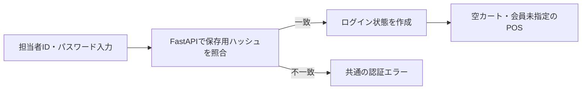

# 認証と運用

[要件本文](../../要件定義書.md) · [設計本文](../../設計仕様書.md) · [対応表](../対応表.md) · [文書マップ](../文書マップ.md)

2026-09-27整理。現行本文から移した詳細の正本。章番号は整理前と共通。条件・数値・承認状態は変更していない。

[8. 認証・セキュリティ設計](#sec-8) / [9. 非機能・配置・運用設計](#sec-9)

## 8. 認証・セキュリティ設計

### 8.1 認証フローとログイン状態

認証方式：

| 対象 | 採用方針 |
|---|---|
| パスワード | Argon2＋pwdlib。平文DB保存・ログ出力・ブラウザ永続保存は行わない |
| ログイン状態 | MySQLに担当者・有効期限を保持。ブラウザにはランダムなセッション識別子を保護Cookieで渡す。復帰Cookieとは別管理 |
| 期限 | [要件4.2](../requirements/機能・非機能要件.md#sec-4-2)の8時間固定をサーバーで判定。操作延長・無操作短縮なし |
| 認証応答不明 | サーバー状態を照会し、有効なら担当者・対象を照合して復帰、未認証なら再入力、照会不能なら停止・内容保持。購入保存は起動しない |

離席中も期限まで認証が続く。認証8時間と通常復帰24時間を分離し、再認証で復帰期限・Cookie消失時の制約を解除しない。

方式参考：[FastAPIのArgon2・pwdlib案内](https://fastapi.tiangolo.com/tutorial/security/oauth2-jwt/#install-pwdlib)。保護・切替の契約は[8.1.2](認証と運用.md#sec-8-1-2)。認証照会不能を未認証と断定しない。

### 8.1.1 期限切れと再認証

通常ログインの初期化を再認証・復帰に実行しない。元の内容・状態を保持して業務操作を止め、同じ担当者の再認証を求める。

| 状況 | 再認証後の扱い |
|---|---|
| 編集中 | 編集へ戻る。会員確認待ち等の制限は維持 |
| 保存中・結果不明 | [7.4](保存処理.md#sec-7-4)で結果照合。確定するまで編集・次取引不可 |
| 誤認証・別担当者 | 内容を保持して元担当者の認証を待つ。担当者を付け替えない |

失効は取消・未保存の証拠ではなく、再認証成功だけで保存を再送しない。対象へのアクセス権は[6.4](通信とデータ.md#sec-6-4)・[8.2](#sec-8-2)で検証し、画面の担当者IDだけを信用しない。

### 8.1.2 Cookie保護・認証切替

| 項目 | 契約 |
|---|---|
| 認証Cookie | `Secure; HttpOnly; SameSite=Lax; Path=/`、Domain指定なし。認証の有効期限までの残時間をMax-Ageに指定。期限の正はDB。復帰Cookieを上書きしない |
| 不正操作防止 | ログイン・再認証を含む全更新APIでOriginと設定済み許可元を完全一致検証し、専用ヘッダー`X-POS-Request: 1`を必須とする。不一致・欠落・null Originは403で副作用なし。CORSは許可元を明示し、任意元・ワイルドカードを許可しない。専用ヘッダーは認証情報ではない |
| 状態照会 | `GET /api/auth/status`。有効なら200＋authenticated・staff_id・expires_at、未認証なら401、DB等の照合不能なら503。`Cache-Control: no-store`。カート作成・保存・期限延長・Cookie発行／削除を行わない |

再認証では資格情報と元担当者・復帰対象を確認後、REGISTERをロックし、新しいランダム識別子のセッション作成・旧セッション失効・有効セッション参照の切替を一括確定する。確定後だけSet-Cookieを返す。カート・会員・購入状態は変更しない。識別子の再利用や、旧認証の復活は行わない。

同時再認証はDBの切替を直列化する。応答順が逆で古いCookieが残っても、サーバーは現在有効なセッションだけを受け付ける。UIは認証後に状態を照会し、元担当者との一致を確認して復帰する。401なら内容保持で再認証、503・応答なしなら停止を維持し、自動で認証POSTを繰り返さない。古い認証応答はCookieを書き換える可能性があるため、画面の応答無視だけで解決済みとしない。

通常ログインにも保護・セッション切替を適用し、継続対象があれば空カートに初期化しない。初回ブラウザ対応との接続は[3.7](画面と業務処理.md#sec-3-7)。配置時は中継経路がOrigin・Cookieを正しく扱うことを確認する（[Q01](../../設計残課題.md#q01)）。参考：[OWASPセッション管理](https://cheatsheetseries.owasp.org/cheatsheets/Session_Management_Cheat_Sheet.html)・[CSRF対策](https://cheatsheetseries.owasp.org/cheatsheets/Cross-Site_Request_Forgery_Prevention_Cheat_Sheet.html)。

### 8.2 アクセス制御

| 対象 | 制御 |
|---|---|
| 通常のログイン・再認証画面／API | 未認証でも情報提示可。再認証は元担当者との関係も検証。誤認証文言：「担当者IDまたはパスワードが正しくありません」 |
| 認証状態照会API | 未認証でも照会可。有効な認証なしでは担当者・カート情報を返さない（[8.1.2](#sec-8-1-2)） |
| POS画面 | 有効なログイン状態が必要 |
| 商品・会員API | APIへ直接アクセスしても未認証なら拒否 |
| カート・取引保存・結果照会 | 認証に加え、対象と担当者の関係をサーバー側で検証する |
| DB | ブラウザから直接接続させない。接続権限・ネットワーク設定は[Q01](../../設計残課題.md#q01)・[Q09](../../設計残課題.md#q09) |

### 8.3 情報保護・入力検証

- 担当者は認証情報から取得。クライアントの担当者・価格を信用しない。
- APIは[5.2](通信とデータ.md#sec-5-2)の型・制約を検証し、金額は保持条件から算出する。
- 暗号化通信、シークレットのサーバー側設定、[9.5](#sec-9-5)のログ項目制限を適用する。
- 会員属性はDBに保持し、POSには必要項目だけ返す。パスワード・個人情報を無条件にログ出力しない。
- ログイン・再認証は同じ担当者IDの直近10分間の5回目の照合失敗で10分制限する。詳細は[設計設定・DB運用](../../設計設定・DB運用.md)[2.1](構成と用語.md#sec-2-1)。

## 9. 非機能・配置・運用設計

### 9.1 配置・設定

**配置方針**：Japan Eastを第一候補とし、Next.jsとFastAPIを別のLinux App Serviceへ配置、1つのBasic B1プラン・1インスタンスを共有して双方Always Onを有効にする。DBは同リージョンのMySQL Flexible Server 8.4・General Purposeの小さい構成を候補とする。

通信設計：ブラウザはNext.jsのHTTPS同一オリジンだけへ接続し、`/api/*`をFastAPIへ中継する。FastAPIの認証・権限は[8.2](認証と運用.md#sec-8-2)のAPI別条件を適用する。Originと`X-POS-Request: 1`の必須検査は[8.1.2](認証と運用.md#sec-8-1-2)の全更新APIに適用し、GETでは両ヘッダーの欠落を拒否理由にしない。中継は許可APIだけに限定し、Cookie・複数Set-Cookie・HTTP状態を維持、キャッシュと変更要求の自動再試行は無効。外部入力で転送先やHostを変えさせない。FastAPIへの中継専用秘密値はサーバー側設定で管理し、受信同名ヘッダーを除去して全中継要求に付与・検証する（担当者認証の代用ではない）。設定値・DB資格情報をNEXT_PUBLIC等へ出さない。

ネットワーク方針：DBは公開エンドポイント＋TLSの証明書／ホスト名検証＋許可IP方式を採る。FastAPIの送信元IP群と、保守時だけ本人のIPを許可し、全Azure許可・全IP許可は使わない。App ServiceのIP変更を伴う構成変更時は再照合する。FastAPI側も中継元IPを制限し、IP制限だけを認証とみなさない。Always On用のヘルス応答はDB・秘密情報を返さず、期限やカートを変更しない。

DB接続はFastAPIのプロセス単位で小さい上限付きプールとし、貸出時の接続確認、破損接続の破棄、TX終了時の返却を行う。採用系列・認証パラメータ・接続数・待ち時間は[設計設定・DB運用](../../設計設定・DB運用.md)1〜[2節](構成と用語.md#sec-2)に従う。プールや中継で更新TXを自動再実行しない。

一次資料確認（2026-09-27）：[プラン共有・課金](https://learn.microsoft.com/en-us/azure/app-service/overview-hosting-plans)、[Always On](https://learn.microsoft.com/en-us/azure/app-service/configure-common)、[送信IP](https://learn.microsoft.com/en-us/azure/app-service/overview-inbound-outbound-ips)、[Container Appsの最小台数](https://learn.microsoft.com/azure/container-apps/scale-app)、[MySQL対応版](https://learn.microsoft.com/en-us/azure/mysql/concepts-version-policy)、[DBサービス層](https://learn.microsoft.com/en-us/azure/mysql/flexible-server/concepts-service-tiers-storage)、[公開接続・許可IP](https://learn.microsoft.com/en-us/azure/mysql/flexible-server/concepts-networking-public)。

### 9.1.1 端末・ブラウザの確認範囲

MacBook Air・iPhone 15各1台のGoogle Chrome通常モードを確認対象とする。タブレットと他の端末・ブラウザは対象外。MacBook Airのモデル、macOS／iOS・Chromeの版は実証前に記録する。同じChromeでも両端末で個別に確認し、画面サイズ模擬だけでカメラ対応合格とはしない。

各対象でログイン・手入力・商品／会員カメラ・数量変更・購入・復帰までを確認する。加えて許可拒否、同コード映り続け／再受付、未登録、99個、応答断、会員待ち、背景移行、画面回転、長い商品名を照合する。[3.5](画面と業務処理.md#sec-3-5)〜[3.8](画面と業務処理.md#sec-3-8)のCookie・localStorage・タブ検知と保守時Cookie再設定も確認対象。カメラ不良時の手入力成功だけではカメラ要件を合格にしない。

### 9.2 性能の実現・測定

索引・必要列だけの照会・通信往復抑制・接続再利用を候補とする。購入の競合制御は省かない。

| 対象 | 測定の開始・終了 | 要件上の条件 |
|---|---|---|
| 商品検索 | 操作開始→結果表示 | 通常時10回、30分無アクセス後1回、各回2秒以内 |
| 会員照会 | 操作開始→結果表示 | 同上 |
| 購入確定 | 操作開始→DB保存成功の表示 | 同上。受付応答だけで終了しない |

放置後測定は各操作の前に30分無アクセスとする。Azure上・通常の安定回線、同じ端末・ネットワーク・データ条件で各回判定し、平均化しない。カメラ認識時間・回線障害は対象外。営業時間全体の安定性を証明する測定ではない。

### 9.3 初期データ・更新手順

担当者のハッシュ化済み認証情報、会員の前提属性、商品、税率、値引き条件を利用開始前に準備する。実在する顧客・決済データは用いない。

値引き対象・期間・内容と税率はコード変更なしで更新可能にする。単価は履歴と一括更新。権限・手順・失敗処理は[9.3](認証と運用.md#sec-9-3)・[9.6](#sec-9-6)。管理画面・専用保守ツールは前提にしない。

**マスタ更新方針**：本人が既存DBクライアントから、レビューしたトランザクションSQLで初期登録・商品／会員／税率／値引きを管理する。専用管理画面・保守APIは作らない。値はパラメータとして渡し、更新前の対象・旧値と更新件数を確認してCOMMITする。不一致や途中失敗は全体ROLLBACK。単価変更では商品をロックし、商品更新とPRICE_HISTORY追加を同一TXにする。関連条件を同時変更する場合も一括確定し、[4.1](画面と業務処理.md#sec-4-1)の読み取り整合性を維持する。

DB利用者は通常アプリ・マスタ保守・スキーマ変更で分ける。通常アプリはマスタ参照、途中取引／セッションの必要更新、売上のSELECT／INSERTに限定し、売上UPDATE／DELETE・マスタ更新・DDLを与えない。カート行削除だけ必要なDELETEを許可。保守利用者にも通常の売上訂正権限を与えない。初回REGISTER=1・担当者ハッシュ・演習用マスタを準備し、認証を省略して初期投入しない。権限割当・初期投入・復旧の作業単位は[設計設定・DB運用](../../設計設定・DB運用.md)3〜[5節](通信とデータ.md#sec-5)に従う。

初期投入順はREGISTER=1（UNSTARTED）→担当者ハッシュ・会員・税率→商品と初期価格履歴→値引き。各投入は認証済みDB接続で行い、件数・コード重複・期間・率／金額を読取確認して確定する。既存レジのUNSTARTEDへの書戻しを初期化手順に含めない。運用は[9.5](認証と運用.md#sec-9-5)、復帰例外は[9.4](認証と運用.md#sec-9-4)。

### 9.4 期限切れ・Cookie消失時の手動確認

開発・運用を兼ねる本人が既存のDBクライアント・ブラウザ管理機能で実施する。専用の管理画面・復旧API・スクリプトは追加しない。具体的な実行SQL・権限の準備状況は[設計残課題](../../設計残課題.md#q10)を参照する。

| 段階 | 作業と解除条件 |
|---|---|
| 停止 | エラー・時刻・担当者・対象IDを記録。REGISTERのmaintenance_holdを有効にし、全APIで業務更新を拒否。全アプリインスタンスの処理を停止し、実行中DB処理が解消したことを確認。ブラウザを閉じただけでは停止完了としない |
| 対象特定 | REGISTER→ブラウザ対応→継続カート→操作→売上・明細・税を照合。対応不整合・複数候補・DB不通なら停止継続。担当者名だけで対象を選ばない |
| 結果確定 | 共通ロック下で売上ありなら既存結果を維持。売上なしで保存受付が残る場合は旧操作を終了しUNSAVEDへ。会員確認待ちは保持して旧照会だけを終了する。継続カートの版を進め、未到着の旧更新を拒否。確定済み売上・明細・条件を変更しない |
| 識別の修復 | Cookie消失・無効の場合だけ、本人が安全な方法で生成した新しい復帰識別値を同じブラウザへ設定し、DB照合値を置換する。旧認証セッションは失効。REGISTERの開始済み・元カート・元担当者は保持。秘密値を作業記録・コマンド履歴へ残さない |
| 照合・解除 | アプリを保守停止状態のまま起動し、同じ担当者の再認証とCookie／対象の読取照合を行う。保存結果・会員待ち等の制限が一致してからmaintenance_holdを解除する。途中失敗なら停止状態を維持し、未確定ならロールバック。確定済みの旧認証失効を安易に元へ戻さない |

保守停止中は認証・権限付きの状態照会だけを許し、新規作成・業務変更・購入保存は拒否する。照会時に期限・Cookieの異常を免除しない。期限切れ対象は下記の手動許可を記録し、期限判定を通ることも確認してから解除する。記録は理由・対象ID・変更前後・実施者・確認結果とし、秘密値やパスワードを含めない。実行コマンド、Cookie設定方法のブラウザ適合、最小権限、停止確認・ロールバックSQLは[Q01](../../設計残課題.md#q01)・[Q03](../../設計残課題.md#q03)・[Q09](../../設計残課題.md#q09)・[Q10](../../設計残課題.md#q10)で具体化する。

**手動復帰後の期限。** 本人が結果・対象を確認して復帰を許可した時刻を`manual_released_at`として保守停止中に別記録し、通常復帰をそこから24時間許可する。期限判定を通ることを読取照合してから保守停止を解除する。判定の起点は最後の業務反映時刻と復帰許可時刻の新しい方。last_business_at・購入日時・売上は書き換えず、通常の照会・認証で例外期間を延長しない。これは本人の手動確認を経た1回の解除であり、レジ画面からの延長・自動復旧は追加しない。初回Cookie受渡し失敗でカートがない場合も開始済みを維持して受渡しを修復し、READY確認後だけ初回カートを作る。

### 9.5 障害確認・バックアップ・配置変更

**運用方針**：DBはAzure標準の自動バックアップを7日保持、診断用アプリログも7日保持。安全な続行を判断できない異常は対象操作を停止してPOS画面に表示し、本人がログとDBを手動確認する。未登録等の入力エラーは既定の修正・再入力を維持する。専用監視画面・外部通知連携は追加しない。途中カート・操作記録・売上・価格履歴は[6.3](通信とデータ.md#sec-6-3)どおり演習中保持し、診断ログの保持期間とは分ける。診断ログは各Linux App ServiceのFile Systemへ7日・初期容量100MBで保存する。出力・閲覧・容量確認は[設計設定・DB運用](../../設計設定・DB運用.md)[7節](保存処理.md#sec-7)に従う。

| 場面 | 手順・判断境界 |
|---|---|
| ログ記録 | UTC時刻、要求／操作ID、API名、処理時間、結果コード、DBエラー分類、配置版を記録。パスワード・Cookie・秘密値・会員属性・要求本文は出さない。API名はルート定義（例：/members/{id}）を使い、会員ID入り実URL・クエリや例外内のSQLパラメータを記録しない。中継・アクセスログも同じ秘匿方針で確認する。ログ閲覧は本人に限定。売上成否はログだけで決めずDB照合 |
| 障害 | 購入応答不明は[7.2](保存処理.md#sec-7-2)、期限／Cookie問題は[9.4](認証と運用.md#sec-9-4)へ。復旧前に最新バックアップ時刻・障害時刻・変更履歴を確認。アプリ再起動だけで未保存と判断しない |
| DB復元 | 標準復元は別サーバーに作成されるため、追加費用・対象時刻を示して実施責任者の許可後に実施。旧DBを残し、復元点以降の売上・操作との差分を照合できるまで切替不可。過去のCookie・認証状態も戻り得るため、旧セッション無効化と[9.4](認証と運用.md#sec-9-4)の対応を確認する |
| アプリ更新 | 配置版と設定の変更点、DB互換性、戻す版を記録。業務を止め、必要ならmaintenance_holdを設定。新旧アプリの同時処理を管理し、読取確認・本人による主要フロー確認後に再開。スロット利用は前提にしない |
| 更新失敗 | DB互換性があれば以前のアプリ版へ戻す。DDLやDB全体を自動で巻き戻さない。データ損失がある復元／削除を単なるロールバックとして実行しない |

保持期間7日は、法定保存期間や復旧時間／無損失保証ではない。バックアップがあっても復元点以降の確定済み売上を消して再開しない。[Azureバックアップ・別サーバーへの復元](https://learn.microsoft.com/en-us/azure/mysql/flexible-server/concepts-backup-restore)を2026-09-27確認。

### 9.6 適用前後の手順と権限

以下は設計手順であり、適用の実行条件は[設計残課題](../../設計残課題.md)に従う。DBクライアントでTLS証明書・ホスト名を検証し、本人の資格情報で接続する。秘密値をSQLファイルや接続URLへ保存しない。

| 工程 | 確認・停止／戻し |
|---|---|
| 適用前 | 対象サーバー／DB・環境名・DDL版・実施者を記録。設計確認.sqlの先頭でDATABASE／VERSION／time_zone／sql_modeを確認。空スキーマか、既存データの変更差分かを区別し、バックアップ・戻すアプリ版・互換性を確認 |
| 初回DDL | 設計スキーマ.sqlの順で1文ずつ実行し成功位置を記録。失敗したら停止。SHOW CREATE TABLEとinformation_schemaで現状照合し、CREATE全体の再送・既存表DROPで修復しない |
| 初期データ | [9.3](#sec-9-3)の順序と対象を確認した演習データで投入。担当者ハッシュは採用方式の正規ツールで生成し平文を残さない。DB接続の認証を省略しない。SELECT結果と件数を確認してCOMMIT |
| 単価変更 | BEGIN→対象PRODUCTをFOR UPDATE→旧値照合→商品UPDATE（条件付き・1件）→PRICE_HISTORYへ旧／新／UTC時刻INSERT（1件）→両方の読取照合→COMMIT。不一致・途中失敗はROLLBACK。COMMIT応答不明では履歴と現値を新接続で照合し無条件再実行しない |
| 利用開始 | 設計確認.sqlの型・参照・状態・金額を照合。別途許可した認証／商品／購入／復帰の確認後、本人が利用開始を判断。データが空で不整合0件だけでは開始可にしない |
| 失敗時 | 未確定DMLはROLLBACK、コミット済みは結果照合。DDLは暗黙COMMITを伴うため適用済み文を特定し、データ保持する修正案を作る。復元／破壊的変更は[9.5](認証と運用.md#sec-9-5)に従う |

権限の正本は[設計設定・DB運用](../../設計設定・DB運用.md)[3節](画面と業務処理.md#sec-3)。AUTH_LOGIN_LIMITの記録権限も含め、アプリにDDL・マスタ更新・売上訂正を付与しない。実アカウント・DB名・接続元は適用前に確定し、SHOW GRANTSで照合する。

