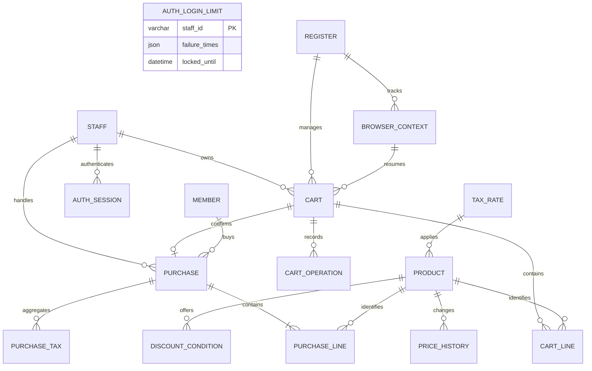

# 通信とデータ

[要件本文](../../要件定義書.md) · [設計本文](../../設計仕様書.md) · [対応表](../対応表.md) · [文書マップ](../文書マップ.md)

2026-09-27整理。現行本文から移した詳細の正本。章番号は整理前と共通。条件・数値・承認状態は変更していない。

[5. インターフェース設計](#sec-5) / [6. データ設計](#sec-6)

## 5. インターフェース設計

### 5.1 API一覧

認証・対象権限は全APIに[8.2](認証と運用.md#sec-8-2)を適用する。

| メソッド・URL | 要求の主項目 | 正常応答の主項目 | 副作用 |
|---|---|---|---|
| POST /api/login | staff_id、password | 担当者表示情報、ログイン状態 | 認証状態を作る。カート作成との接続は[3.7](画面と業務処理.md#sec-3-7)・[8.1.1](認証と運用.md#sec-8-1-1) |
| POST /api/reauth | staff_id、password、復帰用Cookie（[6.4](#sec-6-4)） | 同じ担当者の認証結果 | 認証のみ更新。カート作成・初期化・購入保存なし |
| GET /api/auth/status | 認証Cookie | 認証状態・staff_id・expires_at | 状態照会のみ。401／503の区別と応答は[8.1.2](認証と運用.md#sec-8-1-2) |
| GET /api/products/{code} | 商品コード | code、name、税抜単価 | 検索のみ。商品条件を固定しない |
| GET /api/members/{id} | 会員ID | member_id、確認結果 | 照会のみ。不要な個人属性は返さず、会員変更はカート側で検証 |
| POST /api/register/start | 担当者認証 | 復帰Cookie・開始状態 | UNSTARTEDのみCOOKIE_PENDINGへ（[3.7](画面と業務処理.md#sec-3-7)） |
| GET /api/register/status | 担当者認証・Cookie | 開始状態・Cookie照合結果・利用可否 | 読取専用。欠落時に初期化しない（[3.7](画面と業務処理.md#sec-3-7)） |
| POST /api/register/confirm | 担当者認証・復帰Cookie | READY・利用可否 | Cookie照合後に受取確認。再送可能（[3.7](画面と業務処理.md#sec-3-7)） |
| POST /api/carts | 初回は要求本文なし | cart_id、空リスト、会員未指定 | 認証・Cookie受取確認後に初回作成。REGISTER排他で既存対象があれば返す。次取引はnext |
| GET /api/resume | 同一端末・ブラウザの復帰用Cookie（[6.4](#sec-6-4)） | 対象カート・会員状態・取引識別情報・保存状態・保存済み結果 | [6.4](#sec-6-4)で照合。購入保存なし |
| GET /api/carts/{id} | cart_id | カート状態・行・会員・合計 | 更新応答が不明な場合の照合用 |
| POST /api/carts/{id}/sync | operation_id、version | 最新カート・操作結果 | 復帰時の未到着要求を旧版にする（[5.1.3](#sec-5-1-3)）。売上保存なし |
| POST /api/carts/{id}/lines | code、operation_id、version | 更新後カート | 同一商品加算または新規行・条件作成 |
| PATCH /api/carts/{id}/lines/{line_id} | quantity、operation_id、version | 更新後カート | 指定数量へ変更。差分加算とは区別 |
| DELETE /api/carts/{id}/lines/{line_id} | operation_id、version（クエリに指定） | 更新後カート | 行と保持条件を除去 |
| PUT /api/carts/{id}/member | member_idまたはnull、operation_id、version | 更新後カート・会員状態 | [4.2](画面と業務処理.md#sec-4-2)の会員状態変更と再計算 |
| POST /api/purchases | cart_id、version、operation_id | 保存済み購入結果 | 初回保存または同一取引の保存済み結果取得 |
| GET /api/carts/{id}/purchase | cart_id | 保存状態、保存済みなら購入結果 | 結果照会。未取得を未保存と断定しない |
| POST /api/carts/{id}/resolve-purchase | operation_id、version | 保存結果分類、最新カート | 保存処理と排他して結果を確定。未保存なら旧要求を無効化。[7.2](保存処理.md#sec-7-2)参照 |
| POST /api/carts/{id}/reopen | operation_id、version | 編集可能な最新カート | 未保存確定後だけ編集へ戻す。内容・条件を保持 |
| POST /api/carts/{id}/next | operation_id、version | new_cart_id、最新カート | 保存済み結果の表示終了と次カート作成を一括確定 |
| GET /api/carts/{id}/operations/{operation_id} | パスの2識別子 | 操作状態、new_cart_id（nullable）、照会対象カートの現在値 | 反映確認だけを行い、未受付の操作を実行しない |

認証は[8章](認証と運用.md#sec-8)、初回Cookieは[3.7](画面と業務処理.md#sec-3-7)、会員同期は[4.2](画面と業務処理.md#sec-4-2)、業務入力は[要件3.6](../requirements/機能・非機能要件.md#sec-3-6)に従う。操作可否は[3.4](画面と業務処理.md#sec-3-4)、会員確認待ちは[4.2](画面と業務処理.md#sec-4-2)、未保存確定・編集再開は[7.2](保存処理.md#sec-7-2)を参照。単独の会員検索APIだけでは購入禁止を保証できない。

### 5.1.1 識別の共通方針

cart_id・version・operation_idを共用する（定義は[1.3](構成と用語.md#sec-1-3)、型は[5.2](通信とデータ.md#sec-5-2)）。編集再開でもcart_idを維持し、共通版を進めて旧要求を拒否する。

### 5.1.2 操作の受付・再送契約

結果不明の再送はcart_id・operation_id・version・入力を維持する。未保存確定後の「そのまま再試行」は同じカート・条件で、新操作IDと最新versionを使う。終了した要求は復活させない。

- **入力**：本文を持つPOST・PATCH・PUTはJSON、DELETEはクエリ。register/start・confirm・初回cartsは本文なし。パスのIDを重複指定しない。未定義項目は422。業務入力は追加＝code、数量＝quantity、会員＝member_id。価格・税・合計・担当者IDは採用しない。
- **同一性**：メソッド・ルート、対象カート／行、期待版、型検証後の入力を照合し、比較元を操作記録に保存。JSONキー順・構文上の空白は無視するが文字列内空白は保持。nullと欠落を区別し、コードを勝手に変換しない。
- **排他**：DBトランザクション内でREGISTER→CART→CART_OPERATIONの順にロックし、そのロック下で認証・現在のCookie対応・所有関係・停止状態・期限を再検査。複数行はID順。初回生成はREGISTERで直列化。外部通信・利用者待ちの間はロックしない。
- **判定順**：同操作IDがあれば入力比較を先に行い、異内容は409 `OPERATION_MISMATCH`。一致した完了済み操作は版が古くても結果を返す。未完了は状態を返す（会員再照会は[4.2](画面と業務処理.md#sec-4-2)、購入再送は[7.2](保存処理.md#sec-7-2)）。記録がなければ版・状態を検査し、不一致は409 `VERSION_CONFLICT`／`STATE_CONFLICT`。購入保存済みの例外は[7.2](保存処理.md#sec-7-2)。
- **確定**：通常の商品変更・再計算・版更新・成功記録を一括確定。記録した業務拒否は再送で成功に変えない。DB障害で記録不能なら結果不明。
- **UI**：送信前に要求を固定しタブ内に保持。再読込時は最新カート・受付済み操作をDB照合。記録なしは遅延要求の不存在を証明しない。元要求がなければ推測して再送せず、購入は[7.2](保存処理.md#sec-7-2)で結果確定する。

操作記録には状態と結果参照を保持する。過去時点のカート全体を再送応答にコピーしない。

| 項目 | 値・意味 |
|---|---|
| operation_id | 対象操作のUUID。操作を伴わない照会では省略 |
| operation_status | PREPARED（受付済み・未完了）、APPLIED（反映済み）、REJECTED（終了・再実行不可）、NOT_FOUND（照会時に記録なし） |
| applied_version | 当該操作が確定したカート版。未確定ならnull。最新の版とは区別 |
| cart | 同じ読み取り時点の最新カート。cart_id、version、state、member_state、member_id、lines、税率別集計・合計を含む |
| purchase_status | SAVED、UNSAVED、UNKNOWN、NOT_REQUESTED。購入照会・購入関連応答で返す。判定は[7.2](保存処理.md#sec-7-2)・[7.4](保存処理.md#sec-7-4) |
| purchase | 保存済みの場合だけ、cart_id・購入日時・固定済み明細・集計値。それ以外はnull |
| code | 拒否・失敗、または会員PENDING専用同期成功の機械判定コード。購入結果分類とは別に扱う |

cart.stateはEDITING／SAVING／UNSAVED／SAVED／CLOSED。member_stateは未指定／確認待ち／確認済み／非会員（[4.2](画面と業務処理.md#sec-4-2)）。UNKNOWNは照合結果であり、DB状態を推測して変更しない。

purchase_statusは現在値を使い、SAVED／CLOSED→SAVED、UNSAVED→UNSAVED、SAVING→UNKNOWN、EDITING→NOT_REQUESTEDとする。過去操作がREJECTEDでも後に保存済みならSAVED。NOT_REQUESTEDは未到着要求の不存在を保証せず、過去の未保存結果で現在の操作を許可しない。

GET・再送にも権限を適用し、複数SELECTの照会は主DBの読取専用REPEATABLE READトランザクションで同一スナップショットから返す。変更処理はREAD COMMITTEDのロック下で結果を構成する。UIは小さいversionで表示を戻さず、過去の成功応答で購入・次取引開始を再実行しない。

### 5.1.3 通信中・復帰時の同期

1タブでは更新要求を1件ずつ扱い、通信中は競合する編集・購入を止める。会員確認失敗からの再入力等は[4.2](画面と業務処理.md#sec-4-2)を適用。要求本文は送信前に固定してメモリに保持する。Cookie値・パスワード・会員ID等をJavaScriptの永続ストレージへ保存しない。

購入送信の直前に、cart_id・operation_id・要求版・購入結果確認が必要な旨だけを同一オリジンのlocalStorageへ記録する（cart_id＋operation_idごとに独立した記録）。これは未送信入力の復元ではなく、再読込・終了後にも購入不明を忘れないための補助情報。記録失敗時は購入送信を止めてエラー表示する。他操作の記録を上書きせず、同カートに1件でも記録があれば購入不明として扱う。最終判断はDBの状態・版による。

| 復帰・照合結果 | 処理 |
|---|---|
| 保存済み／SAVING／UNSAVED | [7.2](保存処理.md#sec-7-2)・[7.4](保存処理.md#sec-7-4)に従う。購入自動送信・編集への自動復帰はしない |
| EDITING＋会員確認待ち＋購入不明の補助記録あり | 7.2の会員PENDING専用resolve分岐を先に実行し、下記の条件で補助記録を除去してから会員操作へ戻る |
| 会員確認待ち（購入不明の補助記録なし） | [4.2](画面と業務処理.md#sec-4-2)の再照会／非会員選択を提示 |
| EDITINGかつ購入不明の補助記録あり | 元要求を再構築せず、[7.2](保存処理.md#sec-7-2)のresolve-purchaseで結果を確定。未保存でも編集は明示操作 |
| EDITINGかつ購入不明の補助記録なし | syncを行ってから受付済み内容へ復帰 |
| DB照合不能・認証切れ・Cookie不正・期限切れ | 内容を保持し、それぞれ[8章](認証と運用.md#sec-8)・[3.6](画面と業務処理.md#sec-3-6)へ。新規カートを作らない |

syncは共通ロック下で期待版一致・EDITING・会員確認待ちでないこと・売上なしを確認し、版＋1と操作成功だけを一括確定する。先行操作が先に確定していれば409で再取得し、旧版を最新版へ付け替えて再送しない。syncが先なら未到着の旧要求は版不一致になる。商品・会員・条件・購入状態を変えず、技術的な同期なのでlast_business_atとCookie期限は更新しない。同一sync再送は記録済み結果を返す。

会員PENDING専用分岐の補助記録除去は、送信済み確認操作との対応、同じcart_id、operation_status=APPLIED、code=PURCHASE_FENCED_MEMBER_PENDING、非nullのapplied_versionをすべて確認した場合だけ行う。記録済みapplied_versionを境界に、同カートの要求版がそれ未満の購入補助記録だけを除去する（版はBigInt等で比較）。現在のcart.version、一般NOT_REQUESTED、NOT_FOUNDで代用しない。以後に作られた記録を除去せず、残った記録は別途結果確認する。操作GETには元の確認操作IDを使う。同カートの購入不明補助記録が残っていないことを確認後、現在状態を再取得し、PENDINGなら会員再入力／再照会／非会員選択だけ許可する。商品編集・購入は会員待ち解消まで禁止。現在SAVING／SAVED等ならその制限を優先し、過去の確認成功で編集に戻さない。

ストレージが読めない・記録が破損している場合は「記録なし」と扱わず停止する。記録なしの場合もsyncの成功までは編集を許可しない。GETで操作記録が見つからないだけでは未反映と断定しない。元の商品要求を保持していれば同一再送、失っていればsync後にDB内容を確認する。購入補助記録は保存済みまたは旧要求無効化を確認後に対象分だけ除去する。古い応答では新しい補助記録を消さない。復帰中はカメラ追加を止める。DBが正であり、補助情報だけで保存・未保存を確定しない。

### 5.1.4 API・DB・停止条件の横断照合

全APIに[8章](認証と運用.md#sec-8)の認証・対象権限を適用する。初期表示・認証・読取はカートや売上を自動作成しない。member_stateのAPI値もDBと同じUNSPECIFIED／PENDING／CONFIRMED／NON_MEMBERとし、画面だけ日本語へ変換する。

| API群 | DB状態・副作用の境界 |
|---|---|
| login／reauth／auth/status | 認証のみ。継続カートがある場合は元担当者へ限定。認証だけで24時間期限や売上状態を変更しない |
| register/start・confirm／carts | REGISTERの開始状態・Cookie受取確認に従い初回だけ生成。応答不明から新しい対応を無条件に作らない |
| 商品／会員GET・resume・cart／purchase／operation GET | 読取のみ。会員GET成功だけでカートの会員確定・制限解除をしない。結果照会で売上を作らない |
| 商品追加・数量変更・削除 | EDITINGかつ会員PENDING以外、期待版一致。条件固定・再計算・版・操作結果を一括更新 |
| 会員PUT | EDITINGかつ購入不明等の停止条件なしで指定／再指定・非会員化。PENDING中の再指定も可。購入不明が重なる場合は7.2の専用分岐と5.1.3の補助記録照合を先に行う。旧照会の結果は版・操作IDで拒否 |
| sync／resolve-purchase／reopen | [5.1.3](#sec-5-1-3)・[7.2](保存処理.md#sec-7-2)に限定。GETのNOT_FOUNDだけで編集許可せず、旧要求を無効化したDB確定を確認する |
| purchases／next | [7章](保存処理.md#sec-7)の受付・保存・結果終了の原子性を維持。nextの旧カートCLOSEDと新カート生成は同じTX |

maintenance_hold中は認証と権限付き読取だけを許す。syncやconfirmも変更なので拒否する。初回受渡しを修復する場合は[9.4](認証と運用.md#sec-9-4)で対応を確認し、保守解除後にconfirmを行い、READY後だけ初回カートへ進む。診断ログの期限処理からCART_OPERATION・売上を削除しない。

### 5.2 共通データ定義

| 項目 | 型・意味 | 制約・未決 |
|---|---|---|
| 商品コード・会員ID・担当者ID | 文字列 | [要件3.6](../requirements/機能・非機能要件.md#sec-3-6)の1〜32文字。`[A-Za-z0-9_-]{1,32}`に全体一致。大小文字を区別し、trim・全角変換・数値化をしない |
| quantity | 整数 | 1〜99。範囲外・非整数を拒否 |
| 金額 | 円整数を表す十進文字列 | [要件3.6](../requirements/機能・非機能要件.md#sec-3-6)の円額を十進文字列で送受信。APIとDBで値を一致させる |
| 税率・割引率 | 十進文字列 | 0〜1、刻み0.0001（0.01％）。例：10％は"0.10"。正確な十進数として検証し、丸めて受理しない |
| member_id | 会員IDまたはnull | nullは非会員。通信失敗をnullとみなさない |
| cart_id・line_id | サーバー発行のUUIDv4文字列 | 小文字・ハイフン付き36文字。再利用しない |
| version | 正整数の十進文字列 | 初期値"1"。先頭0なし、最大18446744073709551615。浮動小数点へ変換せず比較する。上限では変更を拒否し、巻き戻さない |
| operation_id | クライアント発行のUUIDv4文字列 | 小文字・ハイフン付き36文字。暗号学的乱数を使用。新しい操作ごとに発行し、同じ要求の再送で維持 |
| 日時 | オフセット付き日時文字列 | [要件3.6](../requirements/機能・非機能要件.md#sec-3-6)。APIはUTCのZ付き日時、表示・期間入力は日本時間。期間判定は開始 ≤ 対象時刻 < 終了 |

値の境界は[要件定義書](../../要件定義書.md)[3.6](画面と業務処理.md#sec-3-6)を正とする。金額上限は全ての保存・表示用円額に適用する。購入日時は[7.2](保存処理.md#sec-7-2)の売上書込処理でサーバーが取得し、既存の保存結果を返す際は保持値を返す。日時の物理精度、コード照合・条件ID順は[6.2.1](通信とデータ.md#sec-6-2-1)による。

versionは商品・数量・会員状態の変更、保存受付、売上確定、未保存確定、編集再開、結果表示終了の各DB確定で1増やす。1回の確定で複数列を変えても増分は1。照会・同一要求の重複応答・変更しない拒否では増やさない。syncと7.2の会員PENDING専用resolveも技術的な同期として版を進める（[5.1.3](#sec-5-1-3)）。保存受付時は売上確定または未保存確定の増分も残せることを確認する。保存受付と売上確定は別のDB確定なので、それぞれ増やす。

UUIDv4の形式は[RFC 9562 §5.4](https://www.rfc-editor.org/rfc/rfc9562.html#section-5.4)を参照。UUIDは認証情報の代わりにはならない。

商品行の応答は名称・数量・保持単価・税率・値引き表示・小計を含む。その他は[5.1.2](通信とデータ.md#sec-5-1-2)の共通応答に従い、保存済み結果を画面の再計算値で置き換えない。

### 5.3 エラー契約

エラー本文は `code`（機械判定用）、`message`（表示用）、必要な項目別情報を持つ。HTTPステータスだけで保存結果を判定しない。

| 状況 | HTTP | 画面・呼出側の扱い |
|---|---|---|
| 誤った認証情報／未認証 | 401 | 共通文言／内容保持して再認証（[8章](認証と運用.md#sec-8)）。401は未保存の証拠にしない |
| 他担当者のカート・取引などアクセス不可 | 403 | 内容を返さず、権限エラー |
| 商品・会員不存在 | 404 | 商品未登録表示／会員の再入力・非会員選択。会員変更中は購入確定不可 |
| 型・必須項目・数量不正 | 422 | 対象項目を示す。数量超過時も元の値を保持 |
| 状態競合・同一キーで別内容・空カート購入 | 409 | 更新拒否・最新取得。取得後の自動再送は禁止。同一要求の再送は[5.1.2](通信とデータ.md#sec-5-1-2) |
| DB・サーバー障害／応答なし | 5xxまたは通信エラー | 会員照会なら確認不能として購入確定不可、保存なら保存結果を別途判断 |

空カート購入の新規受付は409＋`STATE_CONFLICT`（Error）で拒否し、売上を保存しない。判定順は[7.2](保存処理.md#sec-7-2)に従う。

正常完了は200、購入受付済み・継続中は202＋UNKNOWN。応答不明・タイムアウトは未保存としない。UNSAVEDの条件は[7.2](保存処理.md#sec-7-2)、状態値は[5.1.2](通信とデータ.md#sec-5-1-2)による。

### 5.4 再送とOpenAPI

[API契約.openapi.json](../../API契約.openapi.json)に22操作のURL・メソッド・入力／応答型・必須／NULL・エラー・認証・更新ヘッダーを定義する。OpenAPI 3.1.1形式とする。再送・状態・保存順は[本書5.1.2](通信とデータ.md#sec-5-1-2)・[7章](保存処理.md#sec-7)を正とする。不一致を実装者判断で補わず、両方を修正する。[OpenAPI公式仕様](https://spec.openapis.org/oas/v3.1.1.html)を参照。

契約上の補足：認証Cookie名は`__Host-pos_session`（保護属性は[8.1.2](認証と運用.md#sec-8-1-2)）、復帰は[6.4](通信とデータ.md#sec-6-4)の名前を使う。商品検索のunit_priceと購入行のunit_priceは、それぞれ現在マスタ値と保持値。税率別集計はtaxes、税抜小計はsubtotal、税込はtotal。同名でも検索値をカートへ上書きしない。PENDINGの応答member_idはnull、候補はpending_member_id、参考額はamounts_are_reference=trueとし、DBの旧会員IDを適用中として返さない。

POST next応答のcart／new_cart_idは次カート、operation_id／applied_versionは旧カートの終了操作。両カートの版を比較しない。処理済みNEXT再送も同じ次カートを指し、現在値を返す。操作GET以外のGET照会には操作フィールドを付けない。操作GETはパスで指定したカートの現在値をcart／purchase_status／purchaseに返し、applied_versionもそのカートの操作適用版とする。new_cart_idは必須のnullable項目で、NEXT反映済みの場合だけ記録済みの次カートID、それ以外はnull。NOT_FOUNDは200で返すが未保存とはみなさない。会員照会・購入の受付済み未完了は202で返せる。401／403には保護対象cartを含めない。更新APIの必須ヘッダー欠落・不正Originは403、入力不正は422、型不正のJSONは422へ統一する。

代表例は追加要求、追加成功、購入成功、未保存確定、版競合を格納する。検証状況は[設計残課題](../../設計残課題.md)を参照する。

## 6. データ設計

### 6.1 論理ER図

途中カート・売上・マスタ・履歴の論理モデル。物理型・制約方針は[6.2.1](通信とデータ.md#sec-6-2-1)。DDLは[設計スキーマ.sql](../../設計スキーマ.sql)。

売上明細は1件以上、会員は任意。購入時の単価・税率・値引き結果は明細・税集計に固定する。

### 6.2 テーブル定義

主要列・制約の論理定義。共通の物理型・制約は[6.2.1](通信とデータ.md#sec-6-2-1)、列定義は[6.2.2](通信とデータ.md#sec-6-2-2)のSQLを参照。

| テーブル | 主キー・主要列 | 制約・保持目的 |
|---|---|---|
| REGISTER | register_id、利用開始状態、有効ブラウザ対応、継続中取引への参照 | レジ1台1件。UNSTARTED／COOKIE_PENDING／READYと、独立したmaintenance_holdを保持。初回は[3.7](画面と業務処理.md#sec-3-7)、停止は[9.4](認証と運用.md#sec-9-4) |
| BROWSER_CONTEXT | context_id、register_id、開始担当者、token_hash、有効状態、受取確認状態、last_business_at、manual_released_at | Cookieの照合対象（[6.4](#sec-6-4)）。有効な対応はREGISTERの参照で限定。保持は[6.3](通信とデータ.md#sec-6-3) |
| CART | cart_id、register_id、context_id、staff_id、会員状態、active_member_operation_id、購入状態、結果表示終了状態、version | 途中記録。active_purchase_operation_idで購入操作を参照。版は[5.2](通信とデータ.md#sec-5-2)、次取引は[7.5](保存処理.md#sec-7-5) |
| CART_LINE | cart_id、line_id、product_id、数量、追加時単価・税率・値引き候補 | 商品追加時の条件を保持。非会員でも値引き候補を保持 |
| CART_OPERATION | cart_id、operation_id、操作種別、対象行、要求版、正規化入力、status、受付時版、applied_version、結果コード・結果参照 | 主キー(cart_id, operation_id)。受付時版も共通version。状態は[5.1.2](通信とデータ.md#sec-5-1-2)。照合対象を独断で削除しない |
| AUTH_LOGIN_LIMIT | staff_id、failure_times、locked_until | 入力IDごとの失敗時刻（最大5件）と制限期限。不存在IDも同じ扱いのためSTAFFへのFKなし。DB UTC時刻で判定 |
| AUTH_SESSION | セッション照合情報、staff_id、expires_at、失効状態 | MySQLの認証記録。REGISTERの有効セッション参照と照合。物理型・識別子の照合用保存形式・索引は[6.2.1](通信とデータ.md#sec-6-2-1)〜[6.2.2](#sec-6-2-2) |
| STAFF | staff_id、password_hash、担当者表示情報 | ID一意。平文パスワード列を持たない。表示は担当者ID（[3.2](画面と業務処理.md#sec-3-2)） |
| MEMBER | member_id、name、phone、address、gender、age | ID一意。要件F04の6属性を保持。6属性ともNOT NULL、文字列は空文字不可。型は[6.2.1](通信とデータ.md#sec-6-2-1) |
| TAX_RATE | tax_rate_id、rate | 商品が参照する税率。範囲・精度は[5.2](通信とデータ.md#sec-5-2) |
| PRODUCT | product_id、code、name、unit_price、tax_rate_id | 商品コード一意。現在の税抜単価・税率を保持 |
| DISCOUNT_CONDITION | condition_id、product_id、valid_from、valid_to、kind、rateまたはamount | 商品・適用期間・割合／定額の条件をデータ管理。種類に応じ値を限定 |
| PRICE_HISTORY | history_id、product_id、old_price、new_price、changed_at | 購入の有無にかかわらず単価変更を記録。初回はold_price=NULLで登録（[6.2.1](#sec-6-2-1)） |
| PURCHASE | cart_id、staff_id、member_id、purchased_at、subtotal、total | cart_idを主キー兼カート参照として1カート1売上。担当者必須、会員なしはNULL。保存済み取引結果 |
| PURCHASE_LINE | cart_id、line_no、product_id、code_snapshot、name_snapshot、quantity、unit_price_snapshot、tax_rate_snapshot、discount_snapshot、net_unit_price、line_subtotal | 主キーはカートID＋行番号。数量1〜99。名称・計算条件・値引き内容・売上結果を固定 |
| PURCHASE_TAX | cart_id、tax_rate_snapshot、taxable_subtotal、tax_amount | 主キーはカートID＋税率。税率ごとの小計・切捨て後税額を固定 |

`discount_snapshot`は条件ID・種類・率／額・期間・候補額・実値引き額を保持する。適用条件なしと値引き0を区別。スナップショットの構造は[6.2.1](通信とデータ.md#sec-6-2-1)。

ERのREGISTER関連は過去分も含む。現在有効な対応はREGISTERの単一参照で選び、[6.2.1](#sec-6-2-1)の整合検査を行う。

### 6.2.1 物理型・整合性

MySQL 8.4・InnoDBを候補とする。APIは[5.2](通信とデータ.md#sec-5-2)、変更時のロック順は[5.1.2](通信とデータ.md#sec-5-1-2)を維持する。DDLは[6.2.2](通信とデータ.md#sec-6-2-2)を参照する。

| 値 | 物理型・制約 |
|---|---|
| 商品コード・会員ID・担当者ID | `VARCHAR(32) CHARACTER SET ascii COLLATE ascii_bin`。NOT NULL、1〜32文字・許可文字のCHECK、ID／コードにPKまたはUNIQUE。空白も拒否し照合順序だけに依存しない |
| cart_id・line_id・operation_id・context_id | `CHAR(36)`・ascii_bin。APIで小文字UUIDv4を検証。必須関係はNOT NULL |
| マスタ・履歴の内部ID | `BIGINT UNSIGNED`自動採番。condition_idも同型で数値昇順。同額候補の決定順を固定 |
| 円額 | `DECIMAL(12,0)`、CHECKで0〜999999999999。必須列はNOT NULL。計算途中はPythonの整数／Decimalで行い、DB格納前にも範囲検査 |
| 税率・割引率 | `DECIMAL(5,4)`、0〜1。桁超過を丸めて受理せずAPI／マスタ投入時に拒否 |
| 数量・版 | 数量は`TINYINT UNSIGNED`＋1〜99のCHECK。versionは`BIGINT UNSIGNED`＋1以上。上限時の処理は[5.2](通信とデータ.md#sec-5-2) |
| 日時 | `DATETIME(6)`・UTC。DBセッションもUTC。APIはUTC文字列、期間入力は日本時間から変換。期間は開始＜終了。更新ごとにDB時刻を取得し同一処理で共有 |
| 認証・復帰の照合値 | `BINARY(32)`・UNIQUE。認証セッションも乱数のSHA-256照合値だけを保持。パスワードは`VARCHAR(255)`のハッシュ値 |
| 名称・会員属性 | 名称・氏名・電話・住所・性別はutf8mb4のTEXT。会員6属性はNOT NULL、氏名・電話・住所・性別はCHAR_LENGTH>0。年齢はINT UNSIGNED。型容量内で扱い、独自の文字数・年齢上限や性別分類を追加しない |
| 状態・任意値 | 状態はVARCHAR＋許可集合CHECK。会員なし、未確定日時・結果参照はNULL。期限未設定等を通常状態へ読み替えない |

金額・率のCHECKだけではNULLを拒否できないため、必須列にNOT NULLを併用する。SQLの厳格モードを有効にし、アプリ側の型・範囲検査も省略しない。

| テーブル／関係 | 一意性・参照・更新 |
|---|---|
| REGISTER | register_id=1をPK＋CHECKで限定。有効context／cart／sessionは各1参照、初回はNULL。参照先のregister_id・context_id・担当者対応を共通ロック下で検査。作成後に同じTXで参照を設定し、初期化で別行を作らない |
| CART・CART_LINE | CARTのPKはcart_id。行はPK(cart_id,line_id)、UNIQUE(cart_id,product_id)。同じ商品の数量加算を保証。CART→context・staff等にFK。次カートID参照は操作結果へ保存 |
| CART_OPERATION | PK(cart_id,operation_id)。入力は正規化JSONとし金額・版は十進文字列。結果参照・状態・適用版を保持。active操作は同じcartの操作をロック下で検査し、循環FKは増やさない |
| PURCHASE・明細・税 | PURCHASEのPK/FKはcart_id。明細PK(cart_id,line_no)、税PK(cart_id,tax_rate_snapshot)。明細・税→PURCHASEにFK。1件以上の明細、合計一致、対応担当者は保存TX内で検査 |
| マスタ・履歴 | 商品codeにUNIQUE、商品→税率、値引き・価格履歴→商品にFK。初回価格履歴はold_price=NULL・new_price=初期価格、その後は両価格必須。変更がない更新で履歴を増やさない |
| 索引・削除 | PK／UNIQUEとFK索引を基本とし、値引き(product_id,valid_from)、価格履歴(product_id,changed_at,history_id)を追加。FKは原則RESTRICT、売上・履歴の連鎖削除なし。カート行削除は許可済み操作として明示実行 |

途中行の全値引き候補はJSON配列（空は[]）に固定し、条件ID・種類・率／額・期間を保持する。売上明細のdiscount_snapshotは適用条件と候補額・実値引き額、非適用ならnull。金額・率は十進文字列とし、保存時に構造検証する。集計用の数量・単価・税率・小計は独立した型付き列に置く。固定値はマスタ参照から再構成しない。割合条件はrateのみ、定額条件はamountのみが非NULLとなるCHECKを設ける。

DDLは[6.2.2](通信とデータ.md#sec-6-2-2)。MySQLのDDLをDMLと同じROLLBACKで戻せると仮定しない。既存データのDROP・再作成を戻し手順にしない。

参考：[MySQL DECIMAL](https://dev.mysql.com/doc/refman/8.4/en/fixed-point-types.html)、[CHECKとNULL](https://dev.mysql.com/doc/refman/8.4/en/create-table-check-constraints.html)。

### 6.2.2 DDL・確認SQLの具体化

[設計スキーマ.sql](../../設計スキーマ.sql)は16テーブルを親から作り、REGISTERの有効参照FKを最後に追加する。CREATE DATABASE・DROP・初期値・GRANTを含めない。全体を自動再実行する前提にせず、途中失敗なら既存オブジェクトと差分を確認する。[設計確認.sql](../../設計確認.sql)は型／NULL／制約一覧と、REGISTER対応・購入状態・明細／税合計の照合用。

- **状態とNULL**：member_stateはUNSPECIFIED／PENDING／CONFIRMED／NON_MEMBER。PENDINGのpending_member_idは不存在候補も保持するためFKなし。旧member_idは参考計算用に残せるが、適用中として返さない。確定／非会員化時はpending値・active照会を消す。保存受付の操作ID・版、CLOSEDの終了日時をCHECKする。DBのNOT_FOUND行は作らない。
- **SQL外で検査**：担当者・context・cartの所属、active操作の所属と状態、売上1件以上の明細、税率別集計と全合計、初期価格履歴1件／後続の旧値連続性をTX内で確認する。CARTの参考合計とJSON税集計も同じ更新で確定する。行番号はカート内で一意・昇順、削除後の欠番を詰める必要はない。
- **JSON構造**：候補配列の各要素はcondition_id（十進文字列）、kind、rate／amount（片方だけ値、他方null）、valid_from／valid_to（UTC）。適用スナップショットは同項目とcandidate_amount／actual_discount（円十進文字列）を含む。候補なしは[]、適用なしはSQL NULL。種類・必須キー・余分キー・率／円額境界はアプリと投入手順で検証。JSON列だけで正しさを保証しない。
- **会員属性**：F04の初期登録・更新は6属性を必須とし、NULL・空文字を拒否する。年齢は0以上の整数を投入前に検証し、小数をDB変換で受理しない。型容量超過も投入前に拒否する。UUID形式やdecimal入力の余分な小数桁はAPI／投入前検証が必要。DB型の自動変換に任せない。

適用時はMySQL 8.4の空スキーマで構文・制約・境界を検証する。データが空で異常0件となるだけでは合格としない。[MySQLの暗黙COMMIT](https://dev.mysql.com/doc/refman/8.4/en/implicit-commit.html)を踏まえ、適用単位と戻しSQLを準備する。

### 6.3 保持場所と更新規則

| データ | 保持・更新 |
|---|---|
| ログイン状態 | MySQLのサーバー側セッション＋保護Cookie（[8.1](認証と運用.md#sec-8-1)）。復帰対応とは寿命を分離する |
| カート・行・会員状態・条件・計算結果 | MySQL。DB反映確定後に成功応答。アプリメモリだけに保持しない |
| 識別・操作結果・購入結果表示終了・次取引対応 | MySQL。応答不明なら[5.1.2](通信とデータ.md#sec-5-1-2)・[7章](保存処理.md#sec-7)で照合 |
| 未送信入力・選択・カメラ映像 | ブラウザ。復帰対象外（[3.5](画面と業務処理.md#sec-3-5)） |
| 復帰対象の対応 | 永続CookieとMySQL。照合は[6.4](通信とデータ.md#sec-6-4) |
| 保存済み取引 | 明細・税・担当者・会員を一括確定。マスタ変更で書き換えない |
| 単価変更履歴 | 単価更新と旧値・新値・時刻の記録を同一トランザクションで行う |

**途中カートのDB記録は売上確定ではない。** [第7章](保存処理.md#sec-7)の確定成功後だけ購入完了とする。税率・値引き条件の更新は新しい行にだけ反映し、既存行・売上へ遡及しない。条件の一貫した取得は[4.1](画面と業務処理.md#sec-4-1)、マスタ更新入口は[9.3](認証と運用.md#sec-9-3)、物理制約は[6.2](通信とデータ.md#sec-6-2)。

保持方針は[要件3.4](../requirements/機能・非機能要件.md#sec-3-4)を正とする。演習中は途中カート・操作記録・売上・履歴を保持し、期限切れ・Cookie消失でも自動削除しない。削除API・画面・定期処理は追加せず、演習終了後は対象確認・実施責任者の許可を得て削除する。失効状態への更新と行削除を区別し、履歴を壊す連鎖削除は採用しない。バックアップ方式・保持期間は[9.5](認証と運用.md#sec-9-5)。

### 6.4 復帰の照合

Cookieにはサーバー発行の推測しにくい識別情報を保持する。商品・価格・会員・担当者の申告値を信用せず、ログイン状態と分ける。

1. CookieからMySQL上の継続対象を特定する。
2. 元担当者の認証を確認し、失効なら[8.1.1](認証と運用.md#sec-8-1-1)で再認証する。
3. ブラウザ対応・継続対象・認証済み担当者の関係をサーバーで照合する。
4. 権限がある場合だけ[3.5](画面と業務処理.md#sec-3-5)の状態へ復帰する。復帰だけでは購入保存しない。

復帰Cookieの`__Host-pos_resume`に暗号学的乱数32バイトのbase64url値を設定し、DBにはSHA-256照合値のみ保存する。`Secure; HttpOnly; SameSite=Lax; Path=/`、Domain指定なし、保持・更新は[3.6](画面と業務処理.md#sec-3-6)。識別値をログ・URL・レスポンス本文に出さない。通常更新で識別値を変えず、DBの有効対応と照合する。手動再設定で旧対応を無効にした後は、古いCookie応答が届いてもアクセスを許可しない。

認証失効だけで復帰対象を消さない。二要素認証・端末固有性の証明ではない。初回は[3.7](画面と業務処理.md#sec-3-7)、手動再設定は[9.4](認証と運用.md#sec-9-4)。参考：[Set-Cookie](https://developer.mozilla.org/en-US/docs/Web/HTTP/Reference/Headers/Set-Cookie)。

