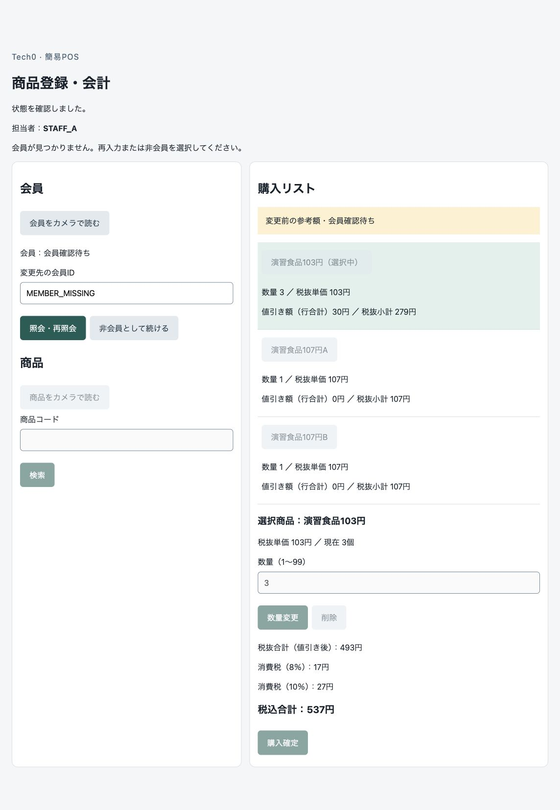

# TC03-P2-01：会員不存在後の復帰 修正・Mac再検証結果

2026-10-04。本人の「修正、再検証をお願いします」に基づき、**会員不存在後に再入力・非会員選択ができないP2を修正し、前回再現したMac手入力の4条件で解消を確認した。** 全ローカル検査145件・build成功。商品編集／購入の禁止と、503で未確認のまま停止する動作を維持した。TC-03全体の受入は未完了で、iPhone・Code128／カメラ経路・本人確認は残る。

[作業票](Mac_TC03_不存在復帰_再検証作業票.md)・[発見時の不具合記録](Mac_TC03_会員不存在後の復帰不具合.md)・[修正前試験](Mac_TC03_追加結果.md)。対象は会員指定・変更からの再入力／非会員選択、商品編集・購入可否の業務手順。[受入：会員](../requirements/受入条件_現行.md#r-topic-23)・[操作制限](../requirements/受入条件_現行.md#r-topic-24)、[設計3.2](../design/画面と業務処理.md#sec-3-2)・[4.2](../design/画面と業務処理.md#sec-4-2)、[TC-03](../tests/テストケース.md#tc-03)を基準とする。

## 修正内容・ローカル確認

アプリ変更は[RegisterCart](../../frontend/app/register-cart.tsx)の確定業務エラー後GET分岐だけ。同一カートの会員PUTが404 MEMBER_NOT_FOUNDで終わり、GET・既存安定性確認に成功したEDITING/PENDINGで、要求した会員候補が一致し、要求より新しい版が採用版と一致する場合にreadyへ戻す。再入力・再照会・非会員操作ができ、PENDINGの間は商品編集／購入を引き続き禁止する。終わった不存在要求は再試行候補から外し、新しい明示選択には新操作IDと最新の版を使う。

未知結果・照合失敗・対象不一致・別タブ通知・認証／期限・購入補助記録等の停止を無条件に解除しない。旧会員を適用中として表示せず、旧額には参考注記を維持する。要件・設計・API・DDL・依存・金額計算・保存処理を変更していない。[今回のアプリ差分](evidence/mac-tc03-fix/application.patch)。

[会員回帰テスト](../../frontend/tests/register-member.test.mjs)に、空／商品あり・初回／変更・会員成功／非会員化の8復帰分岐と11停止境界を追加。実TSXイベント処理と実安定性検査を使う。修正前の分岐では8復帰分岐が失敗し、修正後は会員32件すべて成功した。[修正前](evidence/mac-tc03-fix/regression-before.log)・[修正後](evidence/mac-tc03-fix/regression-after.log)。回帰テスト準備時にGETの既定methodとSAVING時の非表示ボタンのテスト期待を修正した後のログであり、そのテスト準備上の誤りをアプリ欠陥へ数えていない。

`make check`はPython71件＋Node74件＝145件、lint・型・OpenAPI22操作を含め成功。[検査ログ](evidence/mac-tc03-fix/make-check.log)。`make build`はbackend配布物・Next.js本番build成功。[buildログ](evidence/mac-tc03-fix/make-build.log)。追加した証跡検証器のRuff lint／formatと文書検査も成功。[最終補助検査](evidence/mac-tc03-fix/checks.json)。

## 新規専用環境でのMac再検証

固定対象`tech0-pos-mac-tc03-fix-mysql`、専用volume`tech0-pos-mac-tc03-fix-mysql-data`、MySQL 8.4.11 arm64 digest固定、localhost TLS必須。架空データのみ。古い環境・Cookie・期限・証跡は流用・延長・初期化しない。[環境](evidence/mac-tc03-fix/mysql-environment.json)・[TLS／権限](evidence/mac-tc03-fix/mysql-snapshot.json)。MacBook Air（Apple M1・MacBookAir10,1・16GB）、macOS27.0、通常Chrome154.0.8037.97。[端末](evidence/mac-tc03-fix/device.json)・[build／hash／照合](evidence/mac-tc03-fix/verification.json)。

承認済みのCloudflare一時HTTPSを通し、通常UIログイン→利用開始→Cookie受取確認→初回カートを実行。資格情報／Cookieは試験専用で、画面や証跡へ出さない。証明書検証を維持し端末信頼設定を変更していない。検証用API画面は専用profile限定で、同じChromeの通常Cookie自動送信・Origin／X-POS-Request・Next中継・FastAPIを通す。

同じ1カートで以下を順に実施。空の最初の指定以外の「初回」は旧指定会員のない非会員状態からの指定。履歴0の独立カート4個ではない。会員IDは手入力のみ。

| 前提・操作 | 不存在直後 | 追加の状態再確認なしの復帰 | 証跡 |
|---|---|---|---|
| 空カート・非会員から不存在 | PENDING v3・0円・0明細。会員欄／照会／非会員が有効、商品／購入無効 | MEMBER_0を再入力し確認済み、0円保持 | [画面](evidence/mac-tc03-fix/ui-empty-initial-notfound.txt)・[DB](evidence/mac-tc03-fix/db-empty-initial-notfound.json)・[復帰](evidence/mac-tc03-fix/ui-empty-initial-member.txt) |
| 空カート・MEMBER_0から不存在へ変更 | PENDING v6・旧MEMBER_0を確定表示せず0円参考表示。会員操作有効、商品／購入無効 | 非会員を明示選択、0円保持 | [画面](evidence/mac-tc03-fix/ui-empty-change-notfound.txt)・[DB](evidence/mac-tc03-fix/db-empty-change-notfound.json)・[復帰](evidence/mac-tc03-fix/ui-empty-change-nonmember.txt) |
| 商品あり・非会員から不存在 | PENDING v12・570円を参考表示、3明細保持。会員操作有効、商品／数量／削除／購入無効 | MEMBER_0を再入力、537円・参考注記解除・商品操作有効 | [画面](evidence/mac-tc03-fix/ui-lines-initial-notfound.txt)・[DB](evidence/mac-tc03-fix/db-lines-initial-notfound.json)・[復帰](evidence/mac-tc03-fix/ui-lines-initial-member.txt) |
| 商品あり・MEMBER_0から不存在へ変更 | PENDING v15・537円を参考表示、3明細保持。旧会員は未確定表示、会員操作有効、商品／数量／削除／購入無効 | 非会員を明示選択、570円・特典解除・商品操作有効 | [画面](evidence/mac-tc03-fix/ui-lines-change-notfound.txt)・[DB](evidence/mac-tc03-fix/db-lines-change-notfound-before-api.json)・[復帰](evidence/mac-tc03-fix/ui-lines-change-nonmember.txt) |

不存在案内を保持したまま会員操作が可能になっている。

商品あり変更不存在で、正しいカート・最新版15・明細ID・新操作IDの直接追加／数量変更／削除／購入を4要求実施し、すべて409 STATE_CONFLICT。API前後のカート結果は同一。別接続DBでも版・明細・操作・売上等が不変。[要求／応答](evidence/mac-tc03-fix/api-change-notfound-blocked.json)・[後DB](evidence/mac-tc03-fix/db-lines-change-notfound-after-api.json)。正常な購入は実行していない。通常POSの別タブ5条件と旧照会3条件の実証は修正前の別記録にあり、今回それらを実機で再実行したとは扱わない。

## 未知結果の停止を維持した確認

実会員受付COMMIT後、更新トランザクション外で3秒待ち503を返す専用制御を初回／変更の2条件で実施。非会員570円と旧会員537円を参考額として保持し、送信中・503後とも会員／商品／数量／削除／購入は停止。旧会員を確定表示しない。503からは今回の分岐で自動的に操作可能に戻らず、正規の明示照合が必要である。

- 非会員からMEMBER_0：PENDING v17、570円保持。明示状態再確認後の再照会でMEMBER_0・537円へ復帰。[送信中](evidence/mac-tc03-fix/ui-initial-unavailable-sending.txt)・[503画面](evidence/mac-tc03-fix/ui-initial-unavailable.txt)・[DB](evidence/mac-tc03-fix/db-initial-unavailable.json)・[再照会成功](evidence/mac-tc03-fix/ui-initial-unavailable-relookup.txt)。
- MEMBER_0からMEMBER_1：PENDING v20、537円保持。明示状態再確認後に非会員を選択し570円へ復帰。[送信中](evidence/mac-tc03-fix/ui-change-unavailable-sending.txt)・[503画面](evidence/mac-tc03-fix/ui-change-unavailable.txt)・[DB](evidence/mac-tc03-fix/db-change-unavailable.json)・[最終画面](evidence/mac-tc03-fix/ui-final-nonmember.txt)。

## 最終照合・判定・戻し方

9個の別接続DB観測を保存。同じ1カート・担当者STAFF_A、商品あり時の3明細・数量3/1/1・単価103/107/107・税率10/8/8・追加時固定日時を保持。全観測で売上・売上明細・売上税0件、PURCHASE/NEXT操作なし。最終はNON_MEMBER・v21・570円、未確定候補なし。[最終DB](evidence/mac-tc03-fix/db-final.json)。後続の操作履歴でも、各復帰に新SET_MEMBERがAPPLIEDで反映されたことを確認している。成功直後ごとのDB票とDOM取得時刻は記録していないため、各画面とDBの同時刻観測を主張せず、後続DBの操作履歴との照合として扱う。

[保存済み証跡の検証器](../../tools/mac_tc03_fix_verify.py)は、4不存在画面・DB、4直接要求、5032条件、元明細保持、修正差分が修正前hashへ復元可能なことを照合して成功した。[照合結果](evidence/mac-tc03-fix/verification.json)。最初の監査結果を保持し、検証器の書式修正後に再監査して最終結果を保存した。実機試験やDB観測をやり直したという意味ではない。独立したコード・証跡の読取レビューでも今回の修正に確実な追加欠陥は見つからなかった。[独立レビュー](evidence/mac-tc03-fix/independent-review.md)。

今回のトンネル・両アプリ・専用DBを停止し、3307/8443/8444閉鎖・container exited・volume保持を確認。今回生成した秘密値はGit候補・私有ログに含まれない。[終了記録](evidence/mac-tc03-fix/shutdown-final.json)。

**TC03-P2-01は検証したMac手入力の範囲で解消。** iPhone・Code128／カメラ・本人主要フロー・Azureは今回未実施で、TC-03全体の受入合格へ拡張しない。Chrome全体終了、commit／push、本番公開／デプロイも行っていない。

変更ファイルはアプリ1件・会員回帰1件、新規専用wrapper／監査器、既存試験profile許可リストとHTTPS検証画面の提供条件、除外設定、作業票／結果／証跡。戻す場合は[今回のアプリ差分](evidence/mac-tc03-fix/application.patch)の逆適用をレビューし、以前のカメラ／会員参考表示修正を保持する。専用環境は停止状態で保存しているため、今回の不具合修正だけを戻す目的でDB・volume・過去証跡を削除しない。
