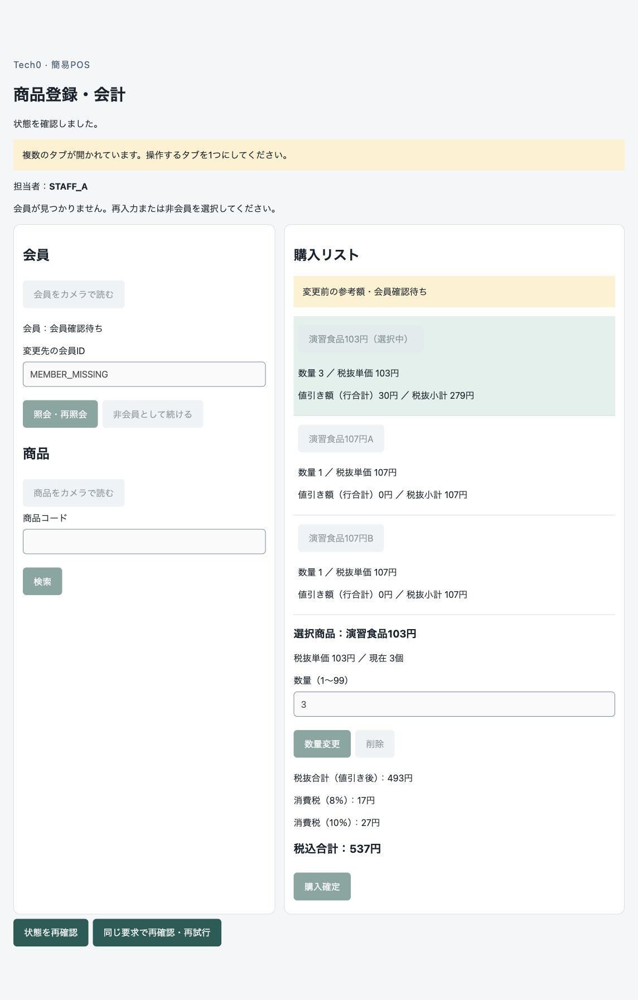

# TC03-P2-01：会員不存在後に再入力・非会員選択ができない

2026-10-04。**P2、修正・Mac手入力4条件で解消を確認済み。** [修正・再検証結果](Mac_TC03_不存在復帰_修正再検証結果.md)。以下は発見時の記録。 [TC-03のMac追加試験](Mac_TC03_追加結果.md)で、商品追加前／後、非会員からの指定／旧会員からの変更の4条件で実機再現した。既に解消した「503時の旧額に参考注記がない」不具合とは別件。

根拠：[会員要件](../requirements/機能・非機能要件.md#r-topic-03)、[受入：会員指定・変更](../requirements/受入条件_現行.md#r-topic-23)・[操作制限](../requirements/受入条件_現行.md#r-topic-24)、[設計3.2](../design/画面と業務処理.md#sec-3-2)・[4.2](../design/画面と業務処理.md#sec-4-2)、[TC-03](../tests/テストケース.md#tc-03)。会員不存在時もリストを保持し、商品編集・購入を止めたまま、再入力・再照会・非会員選択が可能であることを要求する。

## 再現・影響

1. 通常のChromeで認証済みカートを開き、未登録`MEMBER_MISSING`を照会する。
2. 実APIは404 MEMBER_NOT_FOUNDを返し、DBの会員操作はREJECTED/MEMBER_NOT_FOUND、カートはPENDINGを保持する。
3. 画面の自動カートGETと安定性確認が成功する。旧会員を表示せず、参考額も正しく表示される。
4. 「会員が見つかりません。再入力または非会員を選択してください」と表示するが、会員ID欄・照会／再照会・非会員ボタンが全て無効。明示的な「状態を再確認」を追加で押すまで選択できない。

| 条件 | 画面 | DB |
|---|---|---|
| 商品追加前・最初の指定 | [DOM](evidence/mac-tc03/ui-empty-notfound.txt) | [PENDING v3・旧会員なし](evidence/mac-tc03/db-empty-notfound.json) |
| 商品追加前・旧会員から変更 | [DOM](evidence/mac-tc03/ui-empty-change-notfound.txt) | [PENDING v13・旧MEMBER_0](evidence/mac-tc03/db-empty-change-notfound.json) |
| 商品あり・非会員から指定 | [DOM](evidence/mac-tc03/ui-lines-initial-notfound.txt) | [PENDING v19・570円](evidence/mac-tc03/db-lines-initial-notfound-before-api.json) |
| 商品あり・旧会員から変更 | [DOM](evidence/mac-tc03/ui-lines-change-notfound.txt) | [PENDING v24・旧MEMBER_1・537円](evidence/mac-tc03/db-lines-change-notfound-before-api.json) |

内容保持・編集／購入の停止・API拒否・売上0は正常であり、DB安全性の欠陥は確認していない。会員不存在からの画面復帰と案内に反する。独立した読取レビューも同じ原因を確認した。[レビュー](evidence/mac-tc03/independent-review.md)。

## 原因・修正候補・回帰の範囲

`frontend/app/register-cart.tsx`の確定業務エラー後GETでは、同一カート・安定性を確認しても、PENDINGを一律に除外してreadyへ戻らない。その後uncertainへ進み、会員操作が必要とするediting条件がfalseになる。会員の未確認表示フラグは解除済みでも、この操作制限が残る。

最小の修正候補は、会員不存在が確定し、正しい同一カートGETと既存の安定性確認に成功したPENDINGに限り、会員操作を可能にすること。商品編集／購入の禁止は維持する。503・通信失敗・GET失敗・対象不一致・認証／期限・別タブ競合・購入補助記録を無条件解除へ含めない。要件・設計・API・DDLの変更は不要。

修正後は上の4実機条件に加え、正しいPENDING／操作対応、確定不存在から会員成功と非会員化、再照合失敗・不一致・通知競合・認証／期限等の停止を対比して回帰する。既存の126件合格はこの不具合を検出しておらず、この条件の合格証拠ではない。

発見時の試験ではアプリを修正していなかった。修正前の暫定手順は「状態を再確認」後に再入力または非会員を明示選択する。暫定手順で続行できた結果を、本来の条件の合格に読み替えない。
