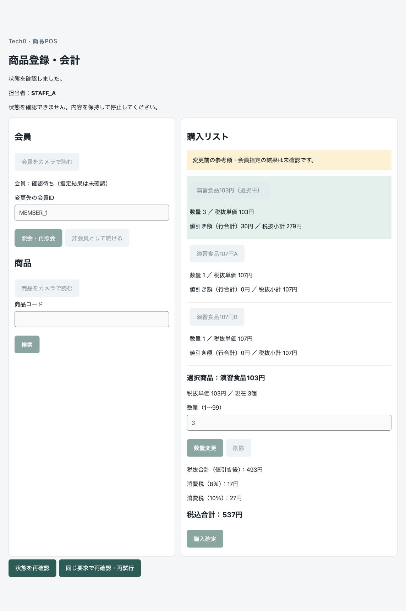

# Mac Chrome：会員未確認表示の実機再検証結果

2026-10-04。**会員照会503のP2は、修正後のMac Chrome・専用MySQLで初回指定／AからBへの変更の両方を再検証し、今回の条件で解消を確認した。** 送信中・結果不明時の会員未確認／旧額の参考表示、編集・購入停止、明示照合後のPENDING、再照会・非会員選択による復帰が整合した。TC-03全体・iPhone・カメラ・Azure・本人受入の合格には拡張しない。

実行根拠は本人の「次に進めて」、既承認の専用DB＋一時HTTPS方式と[作業票](Mac_会員表示_実機再検証作業票.md)。対象は会員指定・変更の業務手順、[受入：会員指定・変更](../requirements/受入条件_現行.md#r-topic-23)・[操作制限](../requirements/受入条件_現行.md#r-topic-24)、[設計3.2](../design/画面と業務処理.md#sec-3-2)・[4.2](../design/画面と業務処理.md#sec-4-2)、[TC-03](../tests/テストケース.md#tc-03)の該当条件。アプリ修正の理由・自動回帰は[修正記録](Mac_会員照会未確認表示_修正.md)を参照。

## 実行環境と障害の位置

新規固定対象は`tech0-pos-mac-member-mysql`／`tech0-pos-mac-member-mysql-data`。MySQL 8.4.11 arm64をdigest固定、localhost:3307・TLS必須、架空データのみ。[環境](evidence/mac-member/mysql-environment.json)・[初期DB/TLS・権限](evidence/mac-member/mysql-snapshot.json)。MacOS 27.0、通常プロファイルのChrome 154.0.8037.97、Node v24.21.0でUIからログイン・開始・Cookie確認した。資格情報の移植・期限延長はしていない。

Next.jsとFastAPIはlocalhost HTTPS、一時Cloudflare HTTPSを中継した。今回の試験専用資格情報・Cookieが承認済みのCloudflare経路を通る。証明書検証を維持し、端末の信頼設定は変更していない。URLは検証時だけ使用し、終了済み。

非会員570円の3明細（103円×3、107円×1を2商品）を用い、実会員受付トランザクションのCOMMIT後に503を発生させた。今回profileだけ3秒待機し、送信中も観測する。公開制御API・偽カート・DB状態書換えはない。初回約3.004秒、変更時約3.007秒で503を発行し、フロント15秒タイムアウトより前。[初回受付](evidence/mac-member/gate-first-fault.json)・[503発行](evidence/mac-member/gate-response-first-fault.json)、[変更受付](evidence/mac-member/gate-change-fault.json)・[503発行](evidence/mac-member/gate-response-change-fault.json)。送信中DOMは503前の観測であり、COMMIT後の観測とは限定しない。

build ID `JZgq0YlIZQIBqIDG2IS3O`とアプリ・回帰テストのhashは修正時の検査対象と一致する。[版・証跡照合](evidence/mac-member/verification.json)。今回アプリコード・要件・設計・API・DDL・依存の追加変更はない。

## 観測結果

| 条件 | 画面と別接続DBの結果 | 証跡 |
|---|---|---|
| 初回会員指定：送信中→503 | 会員は「確認待ち（指定結果は未確認）」、570円は「変更前の参考額」。会員・商品入力、明細編集、購入を停止。DBはEDITING/PENDING v7、候補MEMBER_1、売上0件 | [送信中DOM](evidence/mac-member/ui-first-sending.txt)・[503後DOM](evidence/mac-member/ui-first-unknown.txt)・[DB](evidence/mac-member/db-first-unknown.json) |
| 初回：明示的な状態照合 | 同じカート・操作ID・v7・PENDING。GETで再照会や購入を自動実行せず、商品編集／購入停止、再照会と非会員選択が可能 | [画面](evidence/mac-member/ui-first-pending.txt)・[DB](evidence/mac-member/db-first-pending.json) |
| 初回：非会員を明示選択 | 未指定の非会員・570円、参考注記解除、通常の操作可否へ。次の会員指定を行う前の独立DBスナップショットは採取していない | [画面](evidence/mac-member/ui-first-nonmember.txt)。後続DBのAPPLIED v8で選択反映を確認 |
| 正常な会員A指定 | MEMBER_0、537円（税抜493・税8％17・税10％27）。DB CONFIRMED v10、参考注記なし | [画面](evidence/mac-member/ui-member-a-confirmed.txt)・[DB](evidence/mac-member/db-member-a-confirmed.json) |
| A→B変更：送信中→503 | 旧MEMBER_0を適用中として表示せず、会員未確認と537円の参考表示。編集／購入停止。DB PENDING v11、旧member_idはMEMBER_0・候補MEMBER_1、売上0件 | [送信中DOM](evidence/mac-member/ui-change-sending.txt)・[503後DOM](evidence/mac-member/ui-change-unknown.txt)・[DB](evidence/mac-member/db-change-unknown.json) |
| 変更後：明示的な状態照合 | 同じカート・操作ID・v11・PENDING。旧額を参考表示し、再照会／非会員選択だけが可能。DB・操作記録を変更しない | [画面](evidence/mac-member/ui-change-pending.txt)・[DB](evidence/mac-member/db-change-pending.json) |
| 明示再照会→非会員選択 | 操作者がMEMBER_0を入力して再照会し、CONFIRMED v13・537円へ。その後非会員を選択し、NON_MEMBER v14・570円、旧ID・特典・参考注記解除。両方で通常の編集／購入可へ | [再照会画面](evidence/mac-member/ui-relookup-confirmed.txt)・[DB](evidence/mac-member/db-relookup-confirmed.json)、[非会員画面](evidence/mac-member/ui-final-nonmember.txt)・[最終DB](evidence/mac-member/db-final.json) |

8つのDB観測で同じ1カート・担当者STAFF_A・3明細・数量3/1/1、追加時単価／税率／固定日時を保持。確定会員に応じた値引きのみ変わる。全観測で売上・売上明細・売上税0件、PURCHASE/NEXT操作なし。2つの明示GET前後はカート・明細・操作等が同一。元の2照会は明示的な新選択後にREJECTED/MEMBER_LOOKUP_SUPERSEDEDとなった。[検証コード](../../tools/mac_member_verify.py)・[照合結果](evidence/mac-member/verification.json)。旧応答を後着させる試験は今回行っていない。

## 検査・終了・残り

今回の変更は専用profile追加、試験wrapper、profile限定503待機・証跡、オフライン照合と作業／結果記録。対象PythonツールのRuff lint／format、HTTPS中継のNode構文検査、8観測のオフライン照合、文書リンク・差分検査を実施した。アプリhashが修正時と同じため`make check`・`make build`を再実行していない。前回の126件合格・build成功は[修正時の検査](Mac_会員照会未確認表示_修正.md)であり、今回の実機観測と別の証拠。

独立した欠陥探索の読取レビューも実施。[レビュー記録](evidence/mac-member/independent-review.md)。証跡の時刻と状態、停止条件、環境分離と試験範囲を確認し、追加修正が必要な確実な欠陥なし。

試験用トンネル・両アプリ・今回の専用DBを停止し、3307/8443/8444の非待受とcontainer exited、volume保持を確認。Git候補・私有ログに今回生成した秘密値がないことも確認。[終了証跡](evidence/mac-member/shutdown-final.json)。旧環境は再利用せず、DB・証跡を削除していない。カメラ撮影、iPhone、Chrome全体終了、Azure操作、commit・push・本番公開・デプロイは行っていない。

未確認はTC-03の残り（商品追加前、Code128、両端末の成功／不存在／不能全分岐、別タブ・直接APIからの拒否、旧照会後着等）、iPhoneの修正後表示、TC-04/05の両端末カメラ、Azure・性能／運用、本人の主要フロー受入。P2の今回条件での解消とこれらを分けて扱う。

戻す場合はmac-member profile・wrapper・3秒待機の限定差分だけをレビューし、アプリ修正、旧試験、DB／volume／証跡を保持する。アプリ表示修正自体の戻し方は修正記録に従う。
